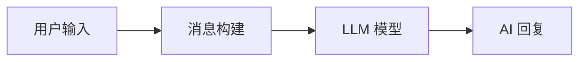

# 第1节：快速开始 -- 你的第一个 LLM 应用

> 学完本节，你将能够用 TypeScript 调用大语言模型并获取回复。


## 简介

什么是 LLM 应用？简单来说，就是你的程序通过 API 向大语言模型（Large Language Model）发送一段文字，模型经过计算后返回一段回复。整个流程可以用三个阶段概括：

**输入 -> 模型 -> 输出**

- **输入**：你构造一段文字（消息），告诉模型你想做什么。
- **模型**：大语言模型接收消息，根据其训练知识和参数配置，生成回复。
- **输出**：模型返回的文本，你的程序可以进一步处理、展示或存储。

LangChain 是一个 LLM 应用开发框架。它不直接训练模型，而是提供了一套标准化的接口和工具链，让你用统一的方式调用不同的模型、组装复杂的流程。在 TypeScript 生态中，LangChain 提供了类型安全的 API 和模块化设计，非常适合构建生产级 LLM 应用。

本节从最基础的部分开始：如何用 LangChain 调用一个聊天模型。


## 核心概念

### Chat Model vs Completion Model

大语言模型有两种主流接口形态：

- **Completion Model（补全模型）**：你给一段文字，模型接着往后写。例如输入 `今天天气真`，模型可能补全为 `今天天气真好，适合出去走走。`
- **Chat Model（聊天模型）**：你给一组带角色标识的消息，模型以对话的方式回复。例如你以"用户"身份提问，模型以"助手"身份回答。

目前主流的 LLM 应用几乎都使用 Chat Model。OpenAI 的 GPT 系列、Anthropic 的 Claude、以及本项目使用的 MIMO 模型，都属于 Chat Model。Chat Model 的优势在于：它天然支持角色设定、多轮对话、指令遵循等场景。

LangChain 中对应的核心类是 `ChatModel`，本教程所有示例都基于 Chat Model。


### 创建模型实例：initChatModel

在 LangChain TypeScript 中，`initChatModel` 是一个通用的模型初始化函数，位于 `langchain/chat_models/universal` 模块。它的作用是用统一的方式创建不同提供商的聊天模型实例。

```typescript
import { initChatModel } from "langchain/chat_models/universal";

const model = await initChatModel("mimo-v2.5-pro", {
  modelProvider: "openai",
  temperature: 0.7,
  maxTokens: 2048,
});
```

几个关键参数说明：

| 参数 | 说明 |
|------|------|
| `temperature` | 温度参数，取值范围 0~1。值越小，输出越确定、越稳定；值越大，输出越随机、越有创意。`0` 适合代码生成、翻译等精确任务；`1` 适合创意写作、头脑风暴。常用值为 `0.7`。 |
| `maxTokens` | 最大输出 token 数，控制模型回复的长度上限。 |
| `modelProvider` | 模型提供商标识。即使模型本身不是 OpenAI 的，只要 API 格式兼容（如 MIMO），就可以指定为 `"openai"`。 |

**环境变量的工作方式：** `initChatModel` 会自动从环境变量中读取 API 密钥和服务地址，不需要在代码中硬编码。具体来说：

- `OPENAI_API_KEY` -- 对应 `.env` 文件中配置的 API Key
- `OPENAI_BASE_URL` -- 对应 `.env` 文件中配置的 API 地址

本项目通过 `dotenv/config` 在入口处自动加载 `.env` 文件，因此这些变量会自动注入到 `process.env` 中。这也是为什么你不会在示例代码里看到密钥 -- 它们不应该出现在代码里。


### `.invoke()` 方法 -- LangChain 的标准调用方式

`.invoke()` 是 LangChain 中所有组件（模型、链、工具等）统一的同步调用接口。对于聊天模型，它接收消息作为参数，返回一个 `AIMessage` 对象。

```typescript
// 最简单的调用：传入一个字符串
const response = await model.invoke("你好");
console.log(response.content); // 输出模型的回复文本
```

当你传入一个普通字符串时，LangChain 会自动将其包装为 `HumanMessage`。你也可以显式传入消息对象或消息数组（后面会讲到）。

`.invoke()` 返回的是一个 `AIMessage` 对象，它不仅包含 `.content`（回复文本），还包含元数据如 token 使用量等信息。


### 消息类型：SystemMessage、HumanMessage、AIMessage

LangChain 定义了三种核心消息类型，对应 LLM 对话中的三个角色：

| 消息类型 | 角色 | 作用 | 典型用途 |
|----------|------|------|----------|
| `SystemMessage` | system | 设定 AI 的行为准则和角色定位 | "你是一位专业的翻译"、"回答要简洁" |
| `HumanMessage` | user | 用户的输入 | 用户的实际问题或指令 |
| `AIMessage` | assistant | 模型的回复 | 存储历史对话中模型之前的回答 |

这三种消息类型都来自 `@langchain/core/messages` 包：

```typescript
import { HumanMessage, SystemMessage, AIMessage } from "@langchain/core/messages";
```

`SystemMessage` 是最容易被低估的消息类型。它虽然不直接产生可见输出，但对模型的行为有深远影响。一个好的 SystemMessage 可以让模型从"什么都聊的通用助手"变成"专注特定领域的专家"。


### 多轮对话：传递消息数组实现上下文

聊天模型的 `.invoke()` 方法不仅接受单条消息，还接受一个消息数组。当你需要进行多轮对话时，把之前的对话历史（包括用户消息和 AI 回复）都放进数组中一起传入，模型就能基于上下文生成回复。

```typescript
const response = await model.invoke([
  new SystemMessage("你是一个友好的助手"),
  new HumanMessage("我叫小明"),
  new HumanMessage("你还记得我叫什么吗？"),
]);
// 模型会基于上下文回答："你叫小明"
```

原理很简单：每次调用时，你把所有历史消息都发给模型，模型看到完整的对话记录后就能"记住"之前的上下文。但要注意，这并不是真正的记忆（后面"进阶补充"会详细说明）。


### Token 概念

Token 是 LLM 处理文本和计费的基本单位。模型不会直接读取字符，而是先把文本切分成 token，再进行计算。

Token 与文本长度的关系大致如下：

- **英文**：1 个单词约等于 1 个 token。"Hello world" 大约是 2 个 token。
- **中文**：1 个汉字约等于 1.5~2 个 token。这是因为中文的信息密度更高，模型需要更多 token 来编码语义。

Token 用量影响两个方面：

1. **费用**：API 按 token 数计费，输入和输出分别计算。
2. **上下文窗口**：每个模型有最大 token 上限（如 4K、8K、128K），超过限制会被截断。

在 LangChain 中，可以通过 `response.usage_metadata` 查看每次调用的 token 消耗。


## 整体流程

下面这张图展示了一次 LLM 调用的完整流程：



具体来说：

1. **用户输入**：你决定想让模型做什么，比如问一个问题。
2. **消息构建**：将输入组装成 LangChain 的消息对象（`SystemMessage`、`HumanMessage` 等），形成消息数组。
3. **LLM 模型**：调用 `.invoke()`，消息数组被发送到模型 API，模型进行推理计算。
4. **AI 回复**：模型返回 `AIMessage` 对象，包含回复文本和元数据。


## 实战

下面是来自 `src/01_chat_model.ts` 的完整示例代码，覆盖了从最简单调用到多轮对话和 token 查看的全部场景。

### 示例 1：简单调用

最基础的用法 -- 传入一个字符串，获取模型回复：

```typescript
import { HumanMessage, SystemMessage } from "@langchain/core/messages";
import { createMimoModel } from "./config.js";

const model = await createMimoModel(0.7);

// .invoke() 是 LangChain 的标准调用方法
// 传入字符串时，LangChain 会自动包装成 HumanMessage
const response1 = await model.invoke("你好，请用一句话介绍自己");
// response1 是一个 AIMessage 对象，.content 是文本内容
console.log("回复:", response1.content);
```

`createMimoModel(0.7)` 是对 `initChatModel` 的封装，创建一个 `temperature=0.7` 的模型实例。传入字符串调用 `.invoke()`，返回的 `AIMessage` 的 `.content` 属性就是模型的回复文本。

### 示例 2：SystemMessage 角色控制

通过 `SystemMessage` 设定模型的角色和回答风格：

```typescript
const response2 = await model.invoke([
  new SystemMessage("你是一位资深的 TypeScript 开发专家，回答要简洁专业"),
  new HumanMessage("什么是泛型？"),
]);
console.log("回复:", response2.content);
```

注意消息数组中的顺序：`SystemMessage` 在前，`HumanMessage` 在后。SystemMessage 会在整个对话过程中持续影响模型的行为。即使你没有显式使用 SystemMessage，模型也有默认的行为模式，但通过 SystemMessage 可以精确控制。

### 示例 3：多轮对话上下文

把历史消息放在数组中一起传入，模型就能"记住"之前的对话：

```typescript
const response3 = await model.invoke([
  new SystemMessage("你是一个友好的助手"),
  new HumanMessage("我叫小明"),
  // 注意：这里没有 AIMessage 回复，模型会根据上下文推断
  new HumanMessage("你还记得我叫什么吗？"),
]);
console.log("回复:", response3.content);
```

这里有一个值得注意的点：上一条 `HumanMessage` 没有对应的 `AIMessage` 回复，但模型仍然能根据上下文理解"我叫小明"这个信息。不过，在实际的多轮对话中，更常见的做法是把 AI 的历史回复也包含进去，这样对话结构更完整。

### 示例 4：查看 Token 使用量

每次 `.invoke()` 调用后，都可以通过 `usage_metadata` 查看 token 消耗：

```typescript
console.log("输入 tokens:", response3.usage_metadata?.input_tokens);
console.log("输出 tokens:", response3.usage_metadata?.output_tokens);
console.log("总 tokens:", response3.usage_metadata?.total_tokens);
```

这对控制成本和调试非常有用。如果你发现 token 用量异常高，可能需要精简 prompt 或限制输出长度。


## 运行方式

确保你已经安装了项目依赖并配置了 `.env` 文件，然后执行：

```bash
npm run 01
```

这会运行 `src/01_chat_model.ts`，你将在终端看到四个示例的输出结果。


## 进阶补充：这并不是"真正的记忆"

在示例 3 中，模型似乎"记住"了用户名字。但这里有一个重要的概念需要理解：**模型本身没有记忆**。

所谓的"多轮对话"，本质上是每次调用时你把所有历史消息重新发送给模型。模型每次都是从零开始处理整段对话记录，它并不记得上一次调用时发生了什么。

这意味着：

- **每次调用都是独立的**：模型不存储任何历史状态。
- **你在代码中手动维护历史**：你需要自己把之前的对话记录保存下来，下次调用时再传入。
- **历史越长，token 越多**：随着对话进行，消息数组越来越大，token 消耗也会线性增长，最终可能触及模型的上下文窗口限制。

真正具备持久化记忆能力的实现，需要额外的存储机制和记忆管理策略，我们将在第7节（Memory）中详细介绍。


## 本节小结

- LangChain 用 `.invoke()` 调用模型，返回 `AIMessage` 对象。
- 三种消息类型（`SystemMessage`、`HumanMessage`、`AIMessage`）分别控制角色设定、用户输入和模型输出，共同构成对话行为的控制手段。
- 多轮对话靠传递消息数组实现，本质上是每次把全部历史重新发送给模型，不是真正的"记忆"。
- Token 是 LLM 计费的基本单位，中文约 1.5~2 token/字，英文约 1 token/词。
- **下一步预告**：第2节将学习提示词模板（Prompt Template），让你用变量化的模板来构建消息，告别手写字符串拼接。
