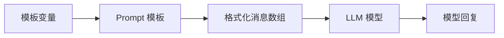

# 第2节：提示词工程 -- 模板与变量

> 学完本节，你将掌握用模板管理提示词，告别字符串拼接。

## 简介

在上一节中，我们直接把提示词写成字符串传给模型。这在演示时没问题，但在真实项目中，提示词往往需要包含动态内容 -- 用户输入、角色设定、上下文信息等。如果用字符串拼接来组装，很快就会陷入混乱：

```typescript
// 反面教材：字符串拼接
const prompt = "你是一位" + role + "，请用" + style + "的风格回答：" + question;
```

这种方式有几个明显的问题：

- **容易出错**：漏掉空格、引号不匹配、变量名写错，排查困难。
- **难以复用**：同样的提示词结构，换个场景就要重新拼一遍。
- **不可读**：模板逻辑和数据混在一起，代码难以维护。

LangChain 提供了专门的**提示词模板（Prompt Template）**来解决这些问题。模板把提示词的"骨架"和"变量"分离，让提示词变得清晰、可复用、易维护。

---

## 核心概念

### PromptTemplate：简单字符串模板

`PromptTemplate` 是最基本的模板类型，适合生成**纯文本提示词**。用 `{变量名}` 作为占位符，调用时传入实际值。

```typescript
import { PromptTemplate } from "@langchain/core/prompts";

const prompt = PromptTemplate.fromTemplate(
  "请将以下文本翻译成{language}，只返回翻译结果：\n\n{input}"
);

// .format() 将变量替换后返回纯字符串
const result = await prompt.format({
  input: "Hello, world!",
  language: "中文",
});
// => "请将以下文本翻译成中文，只返回翻译结果：\n\nHello, world!"
```

注意：`PromptTemplate.format()` 返回的是**纯字符串**，不是消息对象。这意味着它生成的内容没有角色信息（system / human / ai），在对话场景中不够灵活。

### ChatPromptTemplate：对话格式模板（推荐）

在实际的对话应用中，我们需要区分不同的消息角色（system、human、ai）。`ChatPromptTemplate` 为此而生，是大多数场景下的**推荐方案**。

```typescript
import { ChatPromptTemplate } from "@langchain/core/prompts";

const chatPrompt = ChatPromptTemplate.fromMessages([
  ["system", "你是一位{role}，请用{style}的风格回答问题"],
  ["human", "{question}"],
]);
```

`fromMessages()` 接受一个**消息数组**，每条消息是一个 `[角色, 内容]` 元组：

| 角色 | 作用 |
|------|------|
| `"system"` | 系统指令，设定模型的行为、角色、规则 |
| `"human"` | 用户消息，通常是问题或输入 |
| `"ai"` | 模型回复，用于 few-shot 示例 |

与 `PromptTemplate` 不同，`ChatPromptTemplate` 使用 `.formatMessages()` 方法，返回的是**消息对象数组**而非纯字符串：

```typescript
const messages = await chatPrompt.formatMessages({
  role: "Python 迁移专家",
  style: "简洁明了",
  question: "列表推导式在 TS 中怎么写？",
});

// messages 是一个数组，每个元素有 .type 和 .content 属性
// [ { type: "system", content: "你是一位Python迁移专家..." },
//   { type: "human", content: "列表推导式在TS中怎么写？" } ]
```

这些消息对象可以直接传给模型，不需要额外转换。

### PromptTemplate vs ChatPromptTemplate 对比

| 特性 | PromptTemplate | ChatPromptTemplate |
|------|---------------|-------------------|
| 返回类型 | 纯字符串 | 消息对象数组 |
| 角色区分 | 不支持 | 支持 system/human/ai |
| 格式化方法 | `.format()` | `.formatMessages()` |
| 适用场景 | 单轮补全 | 对话场景（推荐） |

### 提示词工程基本原则

写好提示词是用好 LLM 的关键。以下是几条经过实践验证的原则：

**1. 清晰（Be Clear）**

不要让模型猜你的意图。指令越明确，结果越可控。

```
差："翻译这个"
好："请将以下英文翻译成中文，保持专业术语准确，只返回翻译结果"
```

**2. 具体（Be Specific）**

限定输出格式、长度、风格等约束条件。

```
差："总结一下"
好："用3个要点总结以下文章，每个要点不超过20字"
```

**3. 给示例（Give Examples）**

对于复杂任务，提供输入输出示例比长篇描述更有效。这就是 **Few-shot Prompting** 的核心思想。

```typescript
const fewShotPrompt = ChatPromptTemplate.fromMessages([
  ["system", "你是一个情感分析助手，判断文本的情感倾向"],
  ["human", "今天天气真好！"],
  ["ai", "正面"],
  ["human", "又加班到凌晨，烦死了"],
  ["ai", "负面"],
  ["human", "{input}"],
]);
```

模型会从前面的示例中学习模式，然后对新的输入做出类似的判断。

### 模板 + 模型 = 链：`.pipe()` 初体验

LangChain 的 `.pipe()` 方法可以将模板和模型串联起来，形成一条**数据管道**。数据从左边流向右边：模板负责格式化输入，模型负责生成回复。

```typescript
const chain = chatPrompt.pipe(model);

const result = await chain.invoke({
  role: "TypeScript 教师",
  style: "通俗易懂",
  question: "interface 和 type 有什么区别？",
});
```

`.pipe()` 是 LCEL（LangChain Expression Language）的核心方法。本节只做初步体验，下一节将深入讲解 LCEL 管道的各种用法。

---

### 流程图

下面的图展示了从模板变量到模型回复的完整数据流：



模板变量（如 role、question）注入到模板中，生成格式化后的消息数组，再传给 LLM 模型，最终得到回复。

---

## 实战

以下代码来自 `src/02_prompt_template.ts`，展示三种常见的模板用法。

### 示例 1：PromptTemplate -- 翻译任务

用 `PromptTemplate` 构建一个翻译提示词，指定目标语言和待翻译文本：

```typescript
import { PromptTemplate } from "@langchain/core/prompts";

const translatePrompt = PromptTemplate.fromTemplate(
  "请将以下文本翻译成{language}，只返回翻译结果，不要解释：\n\n{input}"
);

// format() 返回纯字符串
const formatted = await translatePrompt.format({
  input: "LangChain makes it easy to build LLM applications",
  language: "中文",
});

console.log("格式化后的提示词:\n", formatted);
```

输出是一段完整的纯文本提示词，可以直接传给不支持消息格式的补全模型。

### 示例 2：ChatPromptTemplate -- 角色扮演问答

用 `ChatPromptTemplate` 定义角色、风格和问题，模板变量在调用时动态替换：

```typescript
import { ChatPromptTemplate } from "@langchain/core/prompts";

const chatPrompt = ChatPromptTemplate.fromMessages([
  ["system", "你是一位{role}，请用{style}的风格回答问题"],
  ["human", "{question}"],
]);

// formatMessages() 返回消息对象数组
const messages = await chatPrompt.formatMessages({
  role: "Python 转 TypeScript 的迁移专家",
  style: "简洁明了、带代码示例",
  question: "Python 的列表推导式在 TypeScript 中怎么写？",
});

messages.forEach((m) => {
  console.log(`  [${m.type}]`, m.content.toString().slice(0, 60) + "...");
});
```

### 示例 3：模板 + 模型 = 完整调用

用 `.pipe()` 将模板和模型串联，一步完成从变量到回复的全流程：

```typescript
import { ChatPromptTemplate } from "@langchain/core/prompts";
import { createMimoModel } from "./config.js";

const model = await createMimoModel(0.7);

const chatPrompt = ChatPromptTemplate.fromMessages([
  ["system", "你是一位{role}，请用{style}的风格回答问题"],
  ["human", "{question}"],
]);

// .pipe() 将模板和模型串联成一条链
const chain = chatPrompt.pipe(model);

// invoke() 时传入变量，模板格式化后自动交给模型
const result = await chain.invoke({
  role: "TypeScript 教师",
  style: "通俗易懂",
  question: "interface 和 type 有什么区别？",
});

console.log("回复:", result.content);
```

模板负责格式化输入，模型负责生成回复，`.pipe()` 把它们无缝连接。

---

### 运行方式

```bash
npm run 02
```

运行后会依次看到：PromptTemplate 格式化的纯文本、ChatPromptTemplate 格式化的消息列表、以及模型对 "interface 和 type 有什么区别？" 的回复。

---

## 进阶补充

### Python 与 TypeScript 的 API 对比

如果你有 Python 版 LangChain 的经验，以下是常用模板 API 的对照：

| 操作 | Python | TypeScript |
|------|--------|-----------|
| 从字符串创建 | `PromptTemplate.from_template("...{x}...")` | `PromptTemplate.fromTemplate("...{x}...")` |
| 从消息创建 | `ChatPromptTemplate.from_messages([...])` | `ChatPromptTemplate.fromMessages([...])` |
| 格式化 | `prompt.format(x="...")` | `await prompt.format({ x: "..." })` |
| 格式化为消息 | `prompt.format_messages(x="...")` | `await prompt.formatMessages({ x: "..." })` |

核心逻辑一致，主要是命名风格不同：Python 用 snake_case，TypeScript 用 camelCase。

### Few-shot Prompting 的概念

Few-shot Prompting 是在提示词中提供少量示例，让模型从示例中学习任务模式。它比零样本（zero-shot）更可靠，比微调（fine-tuning）更轻量。

在 `ChatPromptTemplate` 中实现 few-shot 非常自然：

```typescript
const fewShotPrompt = ChatPromptTemplate.fromMessages([
  ["system", "你是一个代码风格转换器，将 Python 代码转为 TypeScript"],
  ["human", "for i in range(10): print(i)"],
  ["ai", "for (let i = 0; i < 10; i++) { console.log(i); }"],
  ["human", "names = [x for x in students if x.score > 90]"],
  ["ai", "const names = students.filter(x => x.score > 90);"],
  ["human", "{input}"],
]);
```

模型会从前面的示例中理解"Python 转 TypeScript"的模式，然后对新的输入做类似转换。示例越多、越典型，效果越好 -- 但也要注意 token 消耗。

---

## 本节小结

- `PromptTemplate` 适合简单字符串模板，`.format()` 返回纯文本。
- `ChatPromptTemplate` 是对话场景的推荐方案，支持 system / human / ai 角色区分。
- 模板变量用 `{variable}` 占位，调用 `.format()` 或 `.formatMessages()` 时自动替换。
- `.formatMessages()` 返回消息对象数组，可以直接传给模型；`.format()` 返回纯字符串。
- `.pipe()` 可以将模板和模型串联，形成简单的数据管道。
- 提示词工程的核心原则：清晰、具体、给示例。

**下一步预告**：在第3节中，我们将深入学习 **LCEL（LangChain Expression Language）**，了解 `.pipe()` 的完整能力 -- 包括多步骤串联、解析器集成、批量调用和流式输出。
