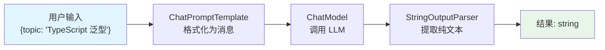
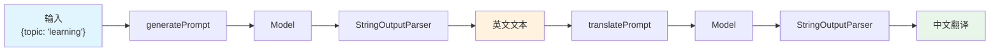
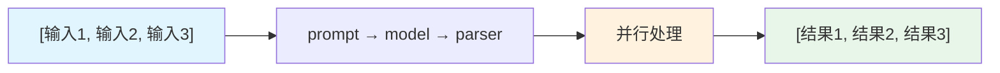

# 第3节：LCEL -- 用管道组装 AI 应用

> LCEL 是 LangChain 的核心编程范式，掌握它就掌握了 LangChain 的精髓。

## 简介

在前面的章节中，我们学会了如何创建 Prompt、调用 Model。但在实际开发中，我们很少单独使用某个组件，而是需要把多个步骤串联起来，形成一条完整的"处理链"。

LCEL（LangChain Expression Language）就是 LangChain 提供的链式组合方案。它用管道（pipe）的思想，将 Prompt、Model、OutputParser 等组件串联在一起，数据从左到右流经每个组件，最终输出我们想要的结果。

为什么需要 LCEL？因为在构建 AI 应用时，最常见的模式就是：

1. 把用户输入格式化成 Prompt
2. 把 Prompt 发送给模型
3. 把模型输出解析成结构化数据

LCEL 让这三个步骤可以用一行代码串起来。

## 核心概念

### LCEL 是什么

LCEL = LangChain Expression Language，是 LangChain 的核心编程范式。它的核心思想是**管道式组合**：用 `.pipe()` 方法将组件串联，数据从左到右流经每个组件。

### .pipe() 方法

`.pipe()` 是 LCEL 的核心方法。调用 `a.pipe(b)` 表示将 `a` 的输出作为 `b` 的输入，多个 `.pipe()` 可以链式调用：

```typescript
const chain = prompt.pipe(model).pipe(parser);
```

数据流动方向：从左到右，依次流经 `prompt` -> `model` -> `parser`。

### Runnable 接口

LCEL 中的所有组件（Prompt、Model、Parser、甚至自定义函数）都实现了统一的 **Runnable** 接口，提供以下方法：

| 方法 | 作用 | 返回值 |
|------|------|--------|
| `.invoke()` | 单次调用 | 单个结果 |
| `.stream()` | 流式调用 | 异步迭代器 |
| `.batch()` | 批量并行调用 | 结果数组 |

无论链有多复杂，都用这三个方法来调用，这就是"统一接口"的含义。

### StringOutputParser

模型返回的是 `AIMessage` 对象，如果只需要纯文本，用 `StringOutputParser` 提取：

```typescript
import { StringOutputParser } from "@langchain/core/output_parsers";

const chain = prompt.pipe(model).pipe(new StringOutputParser());
const result = await chain.invoke({ topic: "TypeScript" });
// result 是 string，不是 AIMessage
```

### 多步骤链

LCEL 的强大之处在于可以组合多个步骤。比如"先生成英文，再翻译成中文"：

```typescript
const english = await generateChain.invoke({ topic: "learning" });
const chinese = await translateChain.invoke({ text: english });
```

### batch() 并行处理

`batch()` 可以并行处理多个输入，比逐个 `invoke` 更高效：

```typescript
const results = await chain.batch([
  { topic: "闭包" },
  { topic: "装饰器" },
  { topic: "异步编程" },
]);
// results 是一个数组，包含三个结果
```

### Zod schema

Zod 是 TypeScript 生态中最流行的数据验证库，相当于 Python 的 Pydantic。在 LangChain 中，Zod 用于定义输出的结构和类型，`.describe()` 方法为每个字段添加说明文档，帮助 LLM 理解该填什么内容。

```typescript
import { z } from "zod";

const schema = z.object({
  title: z.string().describe("电影名称"),
  rating: z.number().min(1).max(10).describe("评分，1-10"),
});
```

### LCEL 的核心优势

- **统一接口**：无论多复杂的链，都用 `.invoke()` / `.stream()` / `.batch()` 调用
- **自动并行**：独立步骤可以自动并行执行，提升性能
- **流式支持**：每个组件的输出可以流式传递，实现逐字输出

## 流程图解

### 基础链：Prompt -> Model -> Parser



### 多步骤链：生成 -> 翻译



### batch() 并行处理



## 实战

完整代码见 `src/03_lcel_chain.ts`，下面分步讲解。

### 基础 LCEL 链

最简单的链：`prompt -> model -> parser`。

```typescript
import { ChatPromptTemplate } from "@langchain/core/prompts";
import { StringOutputParser } from "@langchain/core/output_parsers";
import { createMimoModel } from "./config.js";

const model = await createMimoModel(0.7);

const prompt = ChatPromptTemplate.fromMessages([
  ["system", "用一句话回答，不要多余内容"],
  ["human", "{topic}是什么？"],
]);

const chain = prompt.pipe(model).pipe(new StringOutputParser());

const result = await chain.invoke({ topic: "TypeScript 泛型" });
console.log("纯文本输出:", result);
console.log("类型:", typeof result); // "string"（不是 AIMessage！）
```

关键点：不加 `StringOutputParser` 的话，`invoke` 返回的是 `AIMessage` 对象；加了之后，返回的就是纯文本字符串。

### 多步骤链（生成 + 翻译）

先让模型生成英文内容，再翻译成中文：

```typescript
// 第一步：生成英文内容
const generatePrompt = ChatPromptTemplate.fromTemplate(
  "Write a one-sentence motivational quote about {topic}. Only output the quote."
);
const generateChain = generatePrompt.pipe(model).pipe(new StringOutputParser());

// 第二步：翻译成中文
const translatePrompt = ChatPromptTemplate.fromTemplate(
  "将以下英文翻译成中文，只返回翻译：\n\n{text}"
);
const translateChain = translatePrompt.pipe(model).pipe(new StringOutputParser());

// 顺序调用：先生成英文，再翻译
const english = await generateChain.invoke({ topic: "learning" });
console.log("英文:", english);

const chinese = await translateChain.invoke({ text: english });
console.log("中文:", chinese);
```

这种"生成 -> 后处理"的模式在实际开发中非常常见。

### 批量调用

`batch()` 可以并行处理多个输入，比逐个 `invoke` 更高效：

```typescript
const results = await chain.batch([
  { topic: "闭包" },
  { topic: "装饰器" },
  { topic: "异步编程" },
]);
results.forEach((r, i) => console.log(`  [${i + 1}]`, r));
```

适合需要对多个输入做同样处理的场景，比如批量分析、批量翻译等。

### Zod schema 定义与验证

Zod 是 TypeScript 生态最流行的 schema 验证库，类似 Python 的 Pydantic。`.describe()` 给每个字段加说明，帮助 LLM 理解该填什么：

```typescript
import { z } from "zod";
import { JsonOutputParser } from "@langchain/core/output_parsers";

const movieReviewSchema = z.object({
  title: z.string().describe("电影名称"),
  year: z.number().describe("上映年份"),
  rating: z.number().min(1).max(10).describe("评分，1-10"),
  pros: z.array(z.string()).describe("优点列表，至少2项"),
  cons: z.array(z.string()).describe("缺点列表，至少1项"),
  summary: z.string().describe("一句话总结"),
});

const validatePrompt = ChatPromptTemplate.fromTemplate(
  `你是一个影评专家。请评价以下电影，返回 JSON 格式。
电影: {movie}
要求返回如下 JSON 结构（不要输出其他内容，只输出 JSON）:
{{
  "title": "电影名称",
  "year": 上映年份(数字),
  "rating": 评分1-10(数字),
  "pros": ["优点1", "优点2"],
  "cons": ["缺点1"],
  "summary": "一句话总结"
}}`
);

const validateChain = validatePrompt.pipe(model).pipe(new JsonOutputParser());
const movieResult = await validateChain.invoke({ movie: "星际穿越 (Interstellar)" });

// .parse() 会校验数据是否符合 schema，不符合会抛出错误
try {
  const parsedMovie = movieReviewSchema.parse(movieResult);
  console.log("Zod 验证通过:");
  console.log("  标题:", parsedMovie.title);
  console.log("  评分:", parsedMovie.rating + "/10");
} catch (error) {
  console.log("Zod 验证失败:", error);
}
```

### Zod 与 JsonOutputParser 结合

可以将 Zod schema 的描述传递给 JsonOutputParser，自动在 prompt 中注入格式指令：

```typescript
const techSchema = z.object({
  name: z.string().describe("技术名称"),
  language: z.string().describe("主要编程语言"),
  useCases: z.array(z.string()).describe("使用场景"),
  difficulty: z.enum(["入门", "中级", "高级"]).describe("学习难度"),
  recommendation: z.string().describe("一句话推荐理由"),
});

const techPrompt = ChatPromptTemplate.fromTemplate(
  `分析以下技术栈，返回 JSON 格式：
技术: {tech}
{format}`
);

const techParser = new JsonOutputParser();
const techChain = techPrompt.pipe(model).pipe(techParser);

const techResult = await techChain.invoke({
  tech: "Next.js",
  format: techParser.getFormatInstructions(),
});

const parsedTech = techSchema.parse(techResult);
console.log("  名称:", parsedTech.name);
console.log("  难度:", parsedTech.difficulty);
```

### Zod 高级特性

Zod 支持丰富的数据结构定义，满足复杂场景需求：

```typescript
const advancedSchema = z.object({
  // 基础字段
  name: z.string(),
  age: z.number().min(0).max(150),

  // 可选字段（可以不提供）
  email: z.string().email().optional(),
  phone: z.string().optional(),

  // 带默认值的字段
  status: z.enum(["active", "inactive"]).default("active"),
  createdAt: z.date().default(() => new Date()),

  // 嵌套对象
  address: z.object({
    street: z.string(),
    city: z.string(),
    country: z.string().default("中国"),
    zipCode: z.string().optional(),
  }),

  // 数组字段
  hobbies: z.array(z.string()).min(1).max(5),

  // 联合类型
  role: z.union([
    z.literal("admin"),
    z.literal("user"),
    z.literal("guest"),
  ]),
});
```

常用特性一览：

| 特性 | 语法 | 说明 |
|------|------|------|
| 可选字段 | `.optional()` | 字段可以不提供 |
| 默认值 | `.default(value)` | 不提供时使用默认值 |
| 嵌套对象 | `z.object({...})` | 字段本身也是对象 |
| 数组 | `z.array(schema)` | 限定数组元素类型 |
| 联合类型 | `z.union([...])` | 多选一 |
| 字面量 | `z.literal("admin")` | 只能是固定值 |

`safeParse()` 方法不会抛出错误，而是返回一个结果对象：

```typescript
const result = advancedSchema.safeParse(data);
if (result.success) {
  console.log("验证通过:", result.data);
} else {
  console.log("验证失败:", result.error.issues);
}
```

### StructuredOutputParser -- Zod 直接约束输出

`StructuredOutputParser` 是一种更高级的方式，它会自动从 Zod schema 生成格式指令并注入 prompt，输出时自动校验，无需手动调用 `.parse()`。

```typescript
import { z } from "zod";
import { StructuredOutputParser } from "@langchain/core/output_parsers";

const bookSchema = z.object({
  title: z.string().describe("书名"),
  author: z.string().describe("作者"),
  year: z.number().describe("出版年份"),
  rating: z.number().min(1).max(5).describe("评分，1-5星"),
  tags: z.array(z.string()).describe("标签列表"),
  summary: z.string().describe("一句话推荐"),
});

// 从 Zod schema 创建 parser，自动生成格式指令
const bookParser = StructuredOutputParser.fromZodSchema(bookSchema);

const bookPrompt = ChatPromptTemplate.fromTemplate(
  `推荐一本关于{topic}的书，返回 JSON 格式。

{format}`
);

const bookChain = bookPrompt.pipe(model).pipe(bookParser);

const bookResult = await bookChain.invoke({
  topic: "TypeScript",
  format: bookParser.getFormatInstructions(), // 自动注入 schema 说明
});

// 结果已经过 Zod 校验，类型安全
console.log("书名:", bookResult.title);
console.log("评分:", bookResult.rating);
```

与 `JsonOutputParser` + 手动 `.parse()` 的区别：

- **自动同步**：schema 变更时，格式指令自动更新，无需手动维护 prompt 中的 JSON 结构
- **自动校验**：输出自动经过 Zod 校验，无需手动调用 `.parse()`
- **类型安全**：返回值类型自动推断，IDE 有完整的代码提示

### withStructuredOutput() -- 利用 Function Calling 约束

如果模型支持 function calling，可以用 `withStructuredOutput()` 直接在模型层面约束输出：

```typescript
const techSchema = z.object({
  name: z.string().describe("技术名称"),
  language: z.string().describe("主要编程语言"),
  useCases: z.array(z.string()).describe("使用场景"),
  difficulty: z.enum(["入门", "中级", "高级"]).describe("学习难度"),
  recommendation: z.string().describe("一句话推荐理由"),
});

// 直接在模型上配置 schema
const structuredModel = model.withStructuredOutput(techSchema);

// 输出自动符合 schema，无需额外 parser
const result = await structuredModel.invoke("分析技术栈: Next.js");
console.log("名称:", result.name);
console.log("难度:", result.difficulty);
```

这种方式由模型 API 层面保证输出格式，比 prompt 注入方式更可靠。

### Zod 结构化输出方式对比

| 方式 | 原理 | 优点 | 缺点 |
|------|------|------|------|
| `JsonOutputParser` + `schema.parse()` | prompt 中手动写 JSON 结构，输出后手动校验 | 兼容所有模型，灵活 | 需手动维护 prompt 中的格式 |
| `StructuredOutputParser` | 自动从 Zod schema 生成格式指令并注入 prompt | schema 变更自动同步，自动校验 | 依赖模型遵循指令 |
| `withStructuredOutput()` | 利用模型的 function calling 能力 | 最可靠，由 API 层面保证格式 | 需要模型支持 function calling |

**推荐选择**：
- 模型支持 function calling → 用 `withStructuredOutput()`
- 模型不支持 → 用 `StructuredOutputParser`（自动同步 schema）
- 需要最大灵活性 → 用 `JsonOutputParser` + 手动 `parse()`

## 运行方式

```bash
npm run 03
```

## 进阶补充

### Python vs TypeScript 语法对比

Python 和 TypeScript 的 LCEL 写法有所不同，但语义完全一致：

```python
# Python：用管道符 | 连接
chain = prompt | model | parser
```

```typescript
// TypeScript：用 .pipe() 方法连接
const chain = prompt.pipe(model).pipe(parser);
```

Python 之所以能用 `|` 运算符，是因为它重写了 `__or__` 魔术方法。TypeScript 没有运算符重载的语法，所以改用 `.pipe()` 方法调用，但效果完全相同。

### RunnableSequence.from() 替代写法

除了链式 `.pipe()`，还可以用 `RunnableSequence.from()` 显式创建链，两者完全等价：

```typescript
import { RunnableSequence } from "@langchain/core/runnables";

// 这两种写法效果完全相同
const chain1 = prompt.pipe(model).pipe(parser);
const chain2 = RunnableSequence.from([prompt, model, parser]);
```

`.pipe()` 写法更简洁，推荐日常使用；`RunnableSequence.from()` 写法更显式，适合需要动态构建链的场景。

## 本节小结

- LCEL 用 `.pipe()` 将组件串联成管道，数据从左到右流经每个组件
- 所有组件共享 `invoke` / `stream` / `batch` 统一接口
- `StringOutputParser` 提取纯文本，`JsonOutputParser` 输出 JSON
- `batch()` 可以并行处理多个输入，比逐个 `invoke` 更高效
- Zod 是 TypeScript 生态的 schema 验证标准，用 `.describe()` 为字段添加说明文档
- Zod 可以直接约束输出：`StructuredOutputParser` 自动同步 schema，`withStructuredOutput()` 利用 function calling
- 下一步预告：输出解析器 -- 深入了解各种 OutputParser 的用法与自定义解析器的编写
