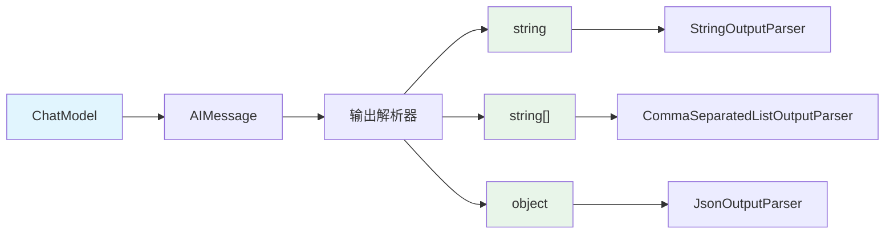

# 第4节：输出解析 -- 让 LLM 返回结构化数据

> LLM 默认返回自由文本，输出解析器帮你把文本转成程序可用的数据结构。

## 简介

在前面的章节中，我们用 LCEL 组装了 `prompt -> model -> parser` 的管道。你可能已经注意到，模型返回的是 `AIMessage` 对象，里面包含了文本内容、元数据等信息。但在实际开发中，我们很少直接使用 `AIMessage`，而是需要从中提取纯文本，或者进一步将文本解析为数组、JSON 对象等结构化数据。

这就是输出解析器（Output Parser）的职责：它坐在管道的末端，负责把模型的原始输出转换成程序可以直接使用的数据类型。

## 核心概念

### 什么是输出解析器

输出解析器是 LCEL 链的最后一个环节。它的作用是将 LLM 返回的 `AIMessage` 对象或自由文本，转换成你期望的数据结构：

- 只要纯文本？用 `StringOutputParser`
- 要一个数组？用 `CommaSeparatedListOutputParser`
- 要一个 JSON 对象？用 `JsonOutputParser`
- 要符合特定 schema 的数据？用 `JsonOutputParser` + Zod 校验

### StringOutputParser -- 最常用

`StringOutputParser` 从 `AIMessage` 对象中提取 `.content` 字符串。它是使用频率最高的解析器，因为大多数场景下你只需要纯文本。

```typescript
import { StringOutputParser } from "@langchain/core/output_parsers";

const chain = prompt.pipe(model).pipe(new StringOutputParser());
const result = await chain.invoke({ concept: "闭包" });
// result 是 string 类型，不是 AIMessage
```

### CommaSeparatedListOutputParser -- 自动注入格式指令

`CommaSeparatedListOutputParser` 将模型输出的逗号分隔文本解析为数组。它的特别之处在于会**自动在 prompt 中注入格式指令**，告诉 LLM "请用逗号分隔输出"，你不需要在模板里写格式要求。

```typescript
const listParser = new CommaSeparatedListOutputParser();
const chain = prompt.pipe(model).pipe(listParser);
const result = await chain.invoke({ category: "前端框架" });
// result 是 string[]，例如 ["React", "Vue", "Angular"]
```

### JsonOutputParser -- 输出 JSON 对象

`JsonOutputParser` 让模型输出合法的 JSON 文本，并自动解析为 JS 对象。配合 `getFormatInstructions()` 方法，可以在 prompt 中自动注入 JSON 格式要求。

```typescript
const jsonParser = new JsonOutputParser();
// 在模板中用 {format} 占位，运行时由 getFormatInstructions() 填充
const chain = prompt.pipe(model).pipe(jsonParser);
const result = await chain.invoke({
  language: "TypeScript",
  format: jsonParser.getFormatInstructions(),
});
// result 是 JS 对象，可以直接用点号访问属性
```

### 结构化输出与 Zod 校验

当需要 LLM 返回符合特定 schema 的数据时，可以将 `JsonOutputParser` 与 Zod 结合使用。Zod 是 TypeScript 生态中最流行的数据验证库，类似 Python 的 Pydantic。`.describe()` 方法为每个字段添加说明，帮助 LLM 理解该填什么。

```typescript
const schema = z.object({
  title: z.string().describe("电影名称"),
  rating: z.number().min(1).max(10).describe("评分，1-10"),
});

// 模型返回 JSON 后，用 schema.parse() 校验
const parsed = schema.parse(result);
```

`schema.parse()` 会在数据不符合定义时抛出错误，确保后续代码拿到的一定是类型安全的数据。

### withStructuredOutput() -- OpenAI 原生方案

`withStructuredOutput()` 是另一种获取结构化输出的方式，它利用模型的 **function calling** 能力，让模型直接输出符合 schema 的数据。

与 `JsonOutputParser` 的区别：

| 对比项 | JsonOutputParser + Zod | withStructuredOutput() |
|--------|------------------------|------------------------|
| 原理 | 在 prompt 中注入格式指令，模型输出 JSON 文本后解析 | 利用模型的 function calling 能力 |
| 模型兼容性 | 兼容所有模型 | 需要模型支持 function calling |
| 可靠性 | 依赖模型遵循指令，偶尔会输出不合法的 JSON | 更可靠，由模型 API 层面保证格式 |

```typescript
const structuredModel = model.withStructuredOutput(schema);
const result = await structuredModel.invoke("分析技术栈: Next.js");
// result 直接是符合 schema 的对象，无需手动解析
```

## 流程图解



## 实战

完整代码见 `src/04_output_parser.ts` 和 `src/06_structured_output.ts`，下面分步讲解。

### StringOutputParser -- 提取纯文本

```typescript
import { ChatPromptTemplate } from "@langchain/core/prompts";
import { StringOutputParser } from "@langchain/core/output_parsers";
import { createMimoModel } from "./config.js";

const model = await createMimoModel(0.3); // 低温度 = 更确定性的输出

const stringParser = new StringOutputParser();
const stringChain = ChatPromptTemplate.fromTemplate("用一句话解释{concept}")
  .pipe(model)
  .pipe(stringParser);

const textResult = await stringChain.invoke({ concept: "闭包" });
console.log("结果:", textResult);
console.log("类型:", typeof textResult); // "string"
```

不加 `StringOutputParser` 的话，`invoke` 返回的是 `AIMessage` 对象；加了之后，返回的就是纯文本字符串。

### CommaSeparatedListOutputParser -- 输出数组

```typescript
import { CommaSeparatedListOutputParser } from "@langchain/core/output_parsers";

const listParser = new CommaSeparatedListOutputParser();
const listChain = ChatPromptTemplate.fromTemplate(
  "列出3个{category}的代表性技术，用逗号分隔"
)
  .pipe(model)
  .pipe(listParser);

const listResult = await listChain.invoke({ category: "前端框架" });
console.log("结果:", listResult);     // ["React", "Vue", "Angular"]
console.log("是数组?", Array.isArray(listResult)); // true
```

注意：你不需要在模板里写"请用逗号分隔输出"，`CommaSeparatedListOutputParser` 会自动注入格式指令。

### JsonOutputParser + getFormatInstructions

```typescript
import { JsonOutputParser } from "@langchain/core/output_parsers";

const jsonParser = new JsonOutputParser();
const jsonChain = ChatPromptTemplate.fromTemplate(
  `分析以下编程语言，返回 JSON 格式。
语言: {language}

{format}`
)
  .pipe(model)
  .pipe(jsonParser);

const jsonResult = await jsonChain.invoke({
  language: "TypeScript",
  format: jsonParser.getFormatInstructions(), // 自动注入 JSON 格式要求
});
console.log("结果:", JSON.stringify(jsonResult, null, 2));
console.log("是对象?", typeof jsonResult === "object"); // true
```

`getFormatInstructions()` 会生成一段格式说明文本，告诉模型输出合法的 JSON。你需要在 prompt 模板中预留一个 `{format}` 占位符来接收它。

### Zod schema + JsonOutputParser 校验

```typescript
import { z } from "zod";
import { JsonOutputParser } from "@langchain/core/output_parsers";

// 用 Zod 定义数据结构，.describe() 帮助 LLM 理解每个字段
const movieReviewSchema = z.object({
  title: z.string().describe("电影名称"),
  year: z.number().describe("上映年份"),
  rating: z.number().min(1).max(10).describe("评分，1-10"),
  pros: z.array(z.string()).describe("优点列表，至少2项"),
  cons: z.array(z.string()).describe("缺点列表，至少1项"),
  summary: z.string().describe("一句话总结"),
});

const jsonParser = new JsonOutputParser();

const prompt = ChatPromptTemplate.fromTemplate(
  `你是一个影评专家。请评价以下电影，返回 JSON 格式。

电影: {movie}

要求返回如下 JSON 结构（不要输出其他内容，只输出 JSON）:
{{
  "title": "电影名称",
  "year": 上映年份(数字),
  "rating": 评分1-10(数字),
  "pros": ["优点1", "优点2"],
  "cons": ["缺点1"],
  "summary": "一句话总结"
}}`
);

const chain = prompt.pipe(model).pipe(jsonParser);
const result = await chain.invoke({ movie: "星际穿越 (Interstellar)" });

// .parse() 会校验数据是否符合 schema，不符合会抛出错误
const parsed = movieReviewSchema.parse(result);
console.log("  标题:", parsed.title);
console.log("  年份:", parsed.year);
console.log("  评分:", parsed.rating + "/10");
console.log("  优点:", parsed.pros);
console.log("  缺点:", parsed.cons);
console.log("  总结:", parsed.summary);
```

### withStructuredOutput() -- OpenAI 原生方案

```typescript
import { z } from "zod";

const techSchema = z.object({
  name: z.string().describe("技术名称"),
  language: z.string().describe("主要编程语言"),
  useCases: z.array(z.string()).describe("使用场景"),
  difficulty: z.enum(["入门", "中级", "高级"]).describe("学习难度"),
  recommendation: z.string().describe("一句话推荐理由"),
});

try {
  const structuredModel = model.withStructuredOutput(techSchema);
  const techResult = await structuredModel.invoke("分析技术栈: Next.js");
  console.log("技术分析:", JSON.stringify(techResult, null, 2));
} catch (error) {
  // 如果模型不支持 function calling，会报错
  console.log("withStructuredOutput() 失败，模型可能不支持 function calling");
  console.log("解决方案: 使用上面的 JsonOutputParser 方案，兼容所有模型。");
}
```

`withStructuredOutput()` 利用 function calling 让模型直接返回符合 schema 的对象，比 prompt 注入方式更可靠。但前提是模型需要支持 function calling 能力。

## 运行方式

```bash
npm run 04   # 运行 StringOutputParser / CommaSeparatedListOutputParser / JsonOutputParser 示例
npm run 06   # 运行 Zod schema + withStructuredOutput 示例
```

## 进阶补充

### 何时使用哪种解析器

| 场景 | 推荐解析器 |
|------|-----------|
| 只需要纯文本 | `StringOutputParser` |
| 需要一个字符串数组 | `CommaSeparatedListOutputParser` |
| 需要 JSON 对象（不关心具体结构） | `JsonOutputParser` |
| 需要符合特定 schema 的数据（兼容所有模型） | `JsonOutputParser` + Zod `.parse()` |
| 需要符合特定 schema 的数据（模型支持 function calling） | `withStructuredOutput()` + Zod |

### JsonOutputParser vs withStructuredOutput 对比

| 对比项 | JsonOutputParser + Zod | withStructuredOutput() |
|--------|------------------------|------------------------|
| 工作原理 | prompt 中注入 JSON 格式指令，解析文本输出 | 模型 API 层面的 function calling |
| 模型兼容性 | 所有模型 | 仅支持 function calling 的模型 |
| 输出可靠性 | 较高，偶尔模型会输出非法 JSON | 高，由 API 层面保证格式 |
| 使用方式 | `prompt.pipe(model).pipe(parser)`，再手动 `schema.parse()` | `model.withStructuredOutput(schema).invoke()`，直接得到结果 |
| 适用场景 | 模型不支持 function calling，或需要最大兼容性 | 模型支持 function calling，追求更高可靠性 |

### Python 对比

Python 版本的写法：

```python
from langchain_core.output_parsers import JsonOutputParser
from pydantic import BaseModel

class MovieReview(BaseModel):
    title: str
    rating: float

parser = JsonOutputParser(pydantic_object=MovieReview)
```

TypeScript 版本用 Zod 替代 Pydantic，语法不同但思路一致：

```typescript
import { z } from "zod";

const movieReviewSchema = z.object({
  title: z.string(),
  rating: z.number(),
});
```

## 本节小结

- `StringOutputParser` 最常用，从 `AIMessage` 中提取纯文本字符串
- `CommaSeparatedListOutputParser` 自动注入格式指令，将逗号分隔文本解析为数组
- `JsonOutputParser` + Zod 是兼容所有模型的结构化输出方案，`getFormatInstructions()` 自动注入 JSON 格式要求
- `withStructuredOutput()` 利用 function calling 能力，更可靠但需要模型支持
- 选择哪种方案取决于你的模型是否支持 function calling，以及对输出可靠性的要求
- 下一步预告：流式输出 -- 用 `.stream()` 实现逐 token 输出，提升用户体验
