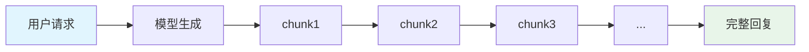
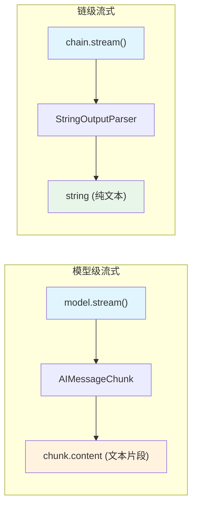

# 第5节：流式输出 -- 打造打字机体验

> 流式输出让用户逐步看到生成内容，这就是 ChatGPT "打字机"效果的实现方式。

## 简介

你有没有注意到，使用 ChatGPT 或 Claude 时，回答不是一瞬间全部出现的，而是一个字一个字地"打"出来。这就是流式输出（Streaming）。

为什么流式输出如此重要？

- **用户体验好**：如果不使用流式，用户需要等待 5-10 秒才能看到完整回复，期间页面一片空白，用户可能以为系统卡死了。
- **感知延迟低**：使用流式输出后，第一个 token 在几百毫秒内就会出现，用户立刻就能感受到"系统在响应"。
- **实时展示**：聊天界面、实时翻译、代码生成等场景天然适合流式输出。

简单来说，流式输出把"等待"变成了"观看"，大幅改善了用户体验。这也是为什么几乎所有主流 AI 聊天应用都采用了流式输出。

## 核心概念

### 不使用流式 vs 使用流式

| 方式 | 等待时间 | 用户感受 |
|------|---------|---------|
| 不使用流式 | 等待 5-10 秒，一次性返回完整结果 | 页面空白，焦虑等待 |
| 使用流式 | 几百毫秒出现第一个 token | 即刻看到内容，体验流畅 |

### model.stream() -- 模型级别流式

`.stream()` 方法返回一个 `AsyncIterable`（异步可迭代对象），可以用 `for await...of` 遍历。每个迭代元素是一个 `AIMessageChunk`，包含当前批次的文本片段：

```typescript
const stream = await model.stream("用5句话介绍 TypeScript");
for await (const chunk of stream) {
  process.stdout.write(chunk.content as string);
}
```

### chain.stream() -- 链级别流式（推荐）

当链中包含 `StringOutputParser` 时，`chain.stream()` 直接返回解析后的字符串，不再是 `AIMessageChunk`。这在实际开发中更常用：

```typescript
const chain = prompt.pipe(model).pipe(new StringOutputParser());
const stream = await chain.stream({ topic: "编程" });
for await (const chunk of stream) {
  process.stdout.write(chunk);  // 直接就是字符串
}
```

### process.stdout.write() -- 打字机效果

`console.log()` 会自动换行，无法实现逐字输出效果。使用 `process.stdout.write()` 可以做到不换行输出，模拟打字机的逐字打印：

```typescript
// console.log() -- 每次换行，不适合流式
console.log(chunk);          // 不行，会换行

// process.stdout.write() -- 不换行，模拟打字机
process.stdout.write(chunk); // 正确，逐字追加
```

### 收集 chunk -- 合并为完整结果

有时候你既想要流式的实时展示效果，又需要在最后拿到完整的文本结果。可以在遍历过程中将每个 chunk 收集到数组中，最后用 `join("")` 合并：

```typescript
const chunks: string[] = [];
const stream = await chain.stream({ topic: "AI 未来" });
for await (const chunk of stream) {
  chunks.push(chunk);
}
const fullText = chunks.join("");
```

### 前端集成方式

在 Web 应用中，流式输出通常有两种集成方式：

| 方式 | 协议 | 适用场景 |
|------|------|---------|
| SSE (Server-Sent Events) | HTTP 单向 | 聊天应用，服务端向客户端单向推送 |
| WebSocket | 双向通信 | 需要双向交互的实时应用 |

ChatGPT 和 Claude 的 Web 界面都使用 SSE 实现流式输出。服务端在生成每个 chunk 时，通过 SSE 推送给前端，前端逐个追加到页面上。

## 流程图解

### 流式输出的数据流动



每个 chunk 包含一小段文本，逐步拼接成完整的回复。用户在 chunk1 到达时就已经开始看到内容，不需要等到全部生成完毕。

### 模型级流式 vs 链级流式



链级流式经过 `StringOutputParser` 后直接输出纯文本，使用更简单，是推荐的方式。

## 实战

完整代码见 `src/05_streaming.ts`，下面分步讲解。

### 模型级别流式输出

最基本的流式用法：直接对模型调用 `.stream()`，逐个接收 `AIMessageChunk`：

```typescript
import { createMimoModel } from "./config.js";

const model = await createMimoModel(0.7);

console.log("=== 模型流式输出 ===");
console.log("逐 token 输出: ");

const stream = await model.stream("用5句话介绍 TypeScript，每句一行");
for await (const chunk of stream) {
  // process.stdout.write 不换行，模拟打字机效果
  process.stdout.write(chunk.content as string);
}
console.log("\n");
```

注意这里每个 chunk 的 `.content` 是 `string | string[]` 类型，我们用 `as string` 做类型断言，因为对于普通文本生成，它始终是字符串。

### 链级别流式输出（推荐）

在实际开发中，我们通常使用 LCEL 链来组合 Prompt + Model + Parser。链的 `.stream()` 方法会自动将解析后的结果流式输出：

```typescript
import { ChatPromptTemplate } from "@langchain/core/prompts";
import { StringOutputParser } from "@langchain/core/output_parsers";
import { createMimoModel } from "./config.js";

const model = await createMimoModel(0.7);

const prompt = ChatPromptTemplate.fromTemplate(
  "写一首关于{topic}的短诗，不超过4行"
);
const chain = prompt.pipe(model).pipe(new StringOutputParser());

console.log("=== 链式流式输出 ===");
console.log("逐 token 输出: ");

const chainStream = await chain.stream({ topic: "编程" });
for await (const chunk of chainStream) {
  process.stdout.write(chunk);  // 直接就是 string，无需 .content
}
console.log("\n");
```

对比模型级流式：链级流式经过 `StringOutputParser` 处理，每个 chunk 直接是 `string` 类型，代码更简洁。

### 收集流式结果

在某些场景下，你需要同时实现两个目标：一边实时展示给用户，一边保留完整结果用于后续处理（比如存入数据库）。可以将 chunk 收集起来：

```typescript
const chunks: string[] = [];
const fullStream = await chain.stream({ topic: "AI 未来" });
for await (const chunk of fullStream) {
  chunks.push(chunk);
}
const fullText = chunks.join("");
console.log("完整结果:", fullText);
console.log("总共收到", chunks.length, "个 chunk");
```

这种方式在实践中非常常见：前端通过 SSE 逐个显示 chunk，同时后端将 chunk 收集起来存入消息记录。

## 运行方式

```bash
npm run 05
```

## 进阶补充

### AIMessageChunk vs AIMessage

`model.invoke()` 返回的是 `AIMessage`，代表一条完整的消息。`model.stream()` 返回的每个元素是 `AIMessageChunk`，代表消息的一个片段。

两者的结构非常相似，都有 `.content`、`.tool_calls` 等字段，但 `AIMessageChunk` 的内容只是完整消息的一部分。

### chunk 合并行为

多个 `AIMessageChunk` 可以通过 LangChain 提供的工具合并为一个完整的 `AIMessage`。当你调用 `model.stream()` 时，LangChain 内部会自动处理 chunk 的拼接逻辑。例如：

```typescript
// LangChain 内部使用 addMessages 来合并 chunk
// 每个新 chunk 的内容会追加到已有的内容上
// 最终合并的结果就是一个完整的 AIMessage
```

在使用 `StringOutputParser` 的场景下，合并逻辑更简单：每个 chunk 的文本片段按顺序拼接，就是完整的回复。

### ChatGPT / Claude 前端如何使用流式

主流 AI 聊天应用的流式实现方式：

1. **后端**：调用 LLM API 时传入 `stream: true`，逐个接收 token
2. **传输**：通过 SSE（Server-Sent Events）将每个 token 推送给前端
3. **前端**：使用 `EventSource` 或 `fetch` + `ReadableStream` 接收 token，逐个追加到页面 DOM 中

SSE 基于 HTTP 协议，实现简单，适合这种"服务端单向推送"的场景。每个 token 作为一条 SSE 消息发送，前端收到后立即渲染，实现打字机效果。

## 本节小结

- `.stream()` 返回 `AsyncIterable`，用 `for await...of` 遍历每个 chunk
- `chain.stream()` 直接输出解析后的字符串，比模型级流式更易用
- 流式大幅改善用户体验，是聊天类应用的标配
- 可以在遍历过程中收集 chunk，最后用 `join("")` 合并为完整结果
- 前端通常使用 SSE（Server-Sent Events）实现流式数据的实时展示
- 下一步预告：工具调用（Tool Calling）-- 让 LLM 能够调用外部工具，获取实时信息
