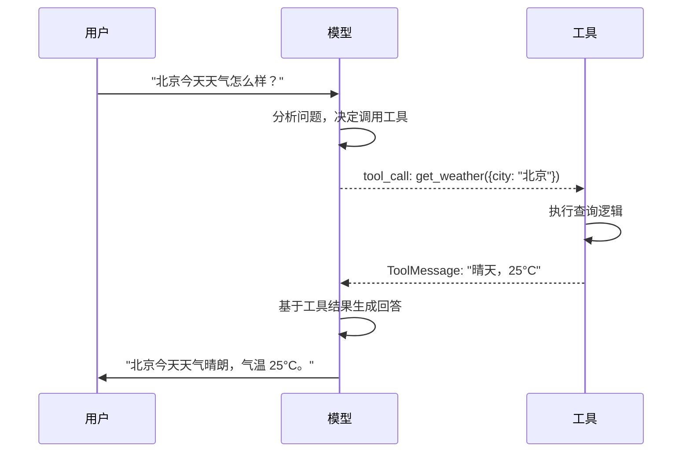
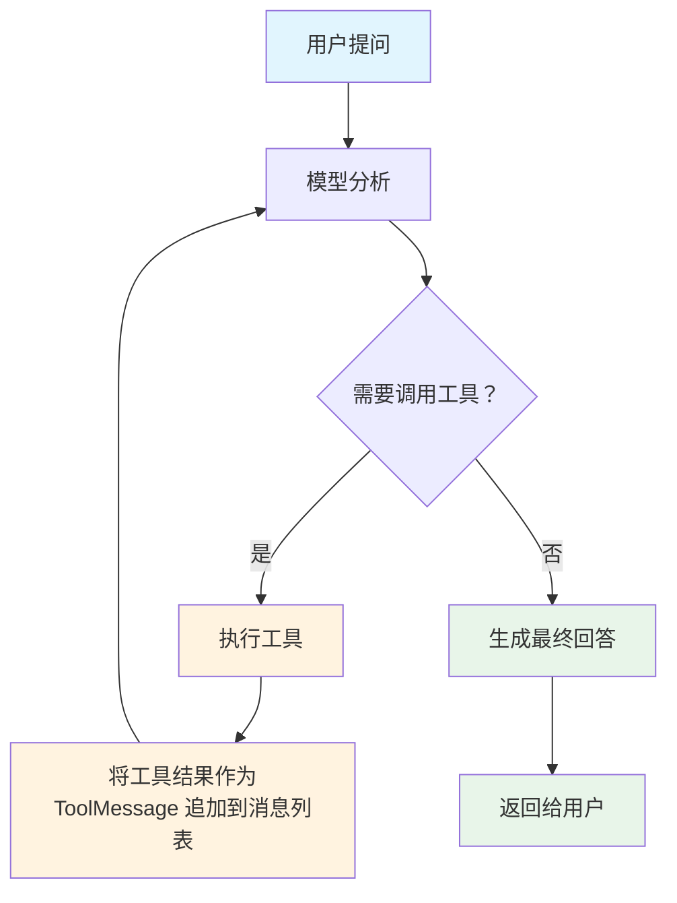
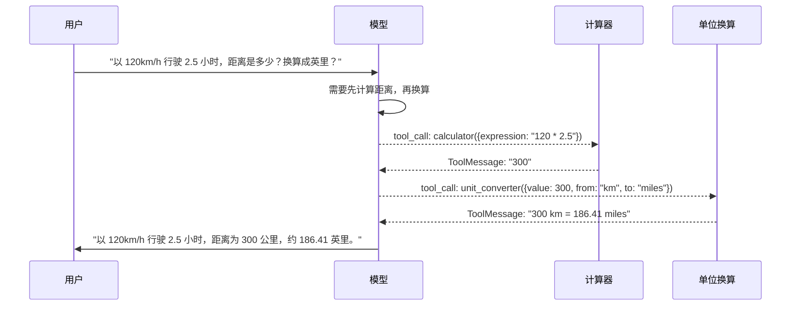

# 第6节：工具调用 -- 让 LLM 连接外部世界

> 工具调用让 LLM 能与外部世界交互：计算、查天气、调 API，而不只是生成文本。

## 简介

LLM 擅长理解和生成自然语言，但它有明显的局限：

- **算数不可靠**：即使是简单的乘法，LLM 也可能算错，因为它本质上是在"预测下一个 token"，而不是在做计算。
- **无法获取实时数据**：LLM 的知识截止于训练数据，无法查询今天的天气、当前的股价或数据库中的记录。
- **无法执行操作**：LLM 无法帮你发邮件、创建文件或调用外部 API。

**工具调用（Tool Calling）** 就是解决这些问题的方案。它的核心思想是：让 LLM 决定"什么时候需要外部帮助"，然后由程序去执行具体的工具，再把结果返回给 LLM 继续处理。

这样 LLM 就从一个"只会说话的助手"变成了一个"能动手做事的助手"。

## 核心概念

### Tool Calling 协议

工具调用的完整流程分为以下几步：

1. 用户提出问题
2. 模型分析问题，决定是否需要调用工具
3. 如果需要，模型返回它想调用的工具名称和参数（`tool_calls`）
4. 程序执行工具，拿到结果
5. 将工具结果作为 `ToolMessage` 反馈给模型
6. 模型基于工具结果生成最终回答

关键在于：**模型不直接执行工具，它只是"提出请求"**。实际的工具执行由你的代码完成。这是出于安全考虑 -- 模型只是一个决策者，真正做事的是你的程序。

### 用 tool() 定义工具

LangChain 用 `tool()` 函数定义工具，需要三个要素：

| 要素 | 作用 | 示例 |
|------|------|------|
| 执行函数 | 工具被调用时执行的异步函数 | `async ({ expression }) => { ... }` |
| name | 工具名称，LLM 用它来引用工具 | `"calculator"` |
| description | 工具描述，LLM 根据描述决定何时使用 | `"数学计算器，输入表达式返回结果"` |
| schema | Zod schema，定义工具接受的参数 | `z.object({ expression: z.string() })` |

```typescript
import { z } from "zod";
import { tool } from "@langchain/core/tools";

const calculatorTool = tool(
  async ({ expression }) => {
    try {
      const result = Function(`"use strict"; return (${expression})`)();
      return `计算结果: ${expression} = ${result}`;
    } catch (e) {
      return `计算错误: 无法计算 "${expression}"`;
    }
  },
  {
    name: "calculator",
    description: "数学计算器。输入数学表达式（如 '2+3*4'），返回计算结果。",
    schema: z.object({
      expression: z.string().describe("数学表达式，如 2+3*4"),
    }),
  }
);
```

工具的 `description` 非常重要 -- 模型完全依赖它来判断什么时候该用这个工具。描述写得越清晰，模型的选择就越准确。

### bindTools() 绑定工具到模型

定义好工具后，需要用 `bindTools()` 告诉模型有哪些工具可用：

```typescript
const modelWithTools = model.bindTools([calculatorTool, weatherTool]);
```

`bindTools()` 会将工具的名称、描述和参数 schema 注入到模型的系统信息中。模型收到用户问题后，会根据这些信息决定是否调用工具、调用哪个工具。

### model 返回 tool_calls

当模型决定调用工具时，它的响应中会包含 `tool_calls` 数组，而不是普通的文本内容：

```typescript
const response = await modelWithTools.invoke("帮我算一下 123 * 456 + 789");

if (response.tool_calls && response.tool_calls.length > 0) {
  for (const tc of response.tool_calls) {
    console.log(`工具: ${tc.name}`);       // "calculator"
    console.log(`参数:`, tc.args);          // { expression: "123 * 456 + 789" }
  }
}
```

每个 `tool_call` 包含：
- `name`：要调用的工具名称
- `args`：传给工具的参数（由 Zod schema 定义）
- `id`：这次调用的唯一标识符（用于将结果关联回去）

### 多工具选择

当绑定多个工具时，模型会根据问题自动选择合适的工具：

```typescript
const tools = [calculatorTool, weatherTool];
const modelWithTools = model.bindTools(tools);

// 问天气 -> 模型选择 get_weather 工具
await modelWithTools.invoke("北京今天天气怎么样？");

// 问计算 -> 模型选择 calculator 工具
await modelWithTools.invoke("123 乘以 456 等于多少？");

// 聊天 -> 模型不调用任何工具，直接回答
await modelWithTools.invoke("你好，今天过得怎么样？");
```

模型完全自主决定是否调用工具、调用哪个工具。你不需要写 if-else 判断逻辑。

### ToolMessage：将工具结果反馈给模型

执行完工具后，需要将结果包装为 `ToolMessage` 并反馈给模型。`ToolMessage` 需要两个参数：工具返回的结果字符串，以及对应的 `tool_call.id`。

```typescript
import { ToolMessage } from "@langchain/core/messages";

// 执行工具
const toolResult = await calculatorTool.invoke(tc.args);
// 将结果包装为 ToolMessage
messages.push(new ToolMessage(toolResult, tc.id!));
```

`tool_call.id` 用来将工具结果和之前的调用请求关联起来，这样模型就知道哪个结果对应哪个请求。

### ReAct 循环：自动迭代调用工具

单次工具调用只解决了简单场景。对于复杂问题（如"以 120km/h 行驶 2.5 小时，距离是多少公里？换算成英里？"），模型可能需要**多次调用不同工具**才能完成任务。

这就是 **ReAct 循环**的核心思想：模型 -> 工具 -> 结果 -> 模型 -> ... -> 最终回答，直到模型不再请求工具调用为止。

```typescript
async function reactAgent(userQuestion: string, maxIterations = 5) {
  const modelWithTools = model.bindTools(tools);
  const messages = [new HumanMessage(userQuestion)];

  for (let i = 0; i < maxIterations; i++) {
    const response = await modelWithTools.invoke(messages);

    if (response.tool_calls && response.tool_calls.length > 0) {
      messages.push(response); // 将模型回复加入消息列表

      for (const tc of response.tool_calls) {
        const targetTool = tools.find((t) => t.name === tc.name);
        const result = await targetTool.invoke(tc.args);
        messages.push(new ToolMessage(result, tc.id!));
      }
    } else {
      return response.content; // 不再调用工具，返回最终回答
    }
  }
}
```

循环的关键：每次工具执行后，将模型的回复（含 `tool_calls`）和工具结果（`ToolMessage`）都追加到消息列表中，然后再次调用模型。模型看到完整的消息历史后，决定是继续调用工具还是给出最终回答。

### 错误处理

工具执行可能失败（网络错误、参数错误等），需要优雅处理：

```typescript
for (const tc of response.tool_calls) {
  const targetTool = tools.find((t) => t.name === tc.name);
  if (targetTool) {
    try {
      const result = await targetTool.invoke(tc.args);
      messages.push(new ToolMessage(result, tc.id!));
    } catch (err) {
      const errorMsg = `工具执行失败: ${err}`;
      messages.push(new ToolMessage(errorMsg, tc.id!));
    }
  } else {
    messages.push(new ToolMessage(`未知工具: ${tc.name}`, tc.id!));
  }
}
```

将错误信息作为 `ToolMessage` 返回给模型，模型可以理解错误并尝试其他方式回答用户的问题。不要让一个工具的失败中断整个对话。

### LCEL 链中的工具集成

工具可以与 LCEL 管道结合使用。先用 `bindTools()` 获得带工具能力的模型，再用 `.pipe()` 组装成链：

```typescript
import { ChatPromptTemplate } from "@langchain/core/prompts";

const analysisPrompt = ChatPromptTemplate.fromMessages([
  ["system", "你是一个数据分析师。用计算器工具完成计算，然后用文字总结结果。"],
  ["human", "{question}"],
]);

const baseModel = await createMimoModel(0.3);
const analysisModel = baseModel.bindTools([calculatorTool]);
const analysisChain = analysisPrompt.pipe(analysisModel);

const result = await analysisChain.invoke({
  question: "如果一个产品单价 99 元，卖出 1500 件，总营收是多少？",
});
```

这样就把工具调用能力集成到了 LCEL 的标准工作流中。

## 流程图解

### 单次工具调用流程



### ReAct 循环流程



### 多工具协作流程



## 实战

完整代码见 `src/07_tools_and_agent.ts` 和 `src/10_tool_calling_chain.ts`，下面分步讲解。

### 定义计算器和天气工具

用 `tool()` 定义两个工具：一个数学计算器，一个天气查询（模拟数据）：

```typescript
import { z } from "zod";
import { tool } from "@langchain/core/tools";

// 计算器工具：执行数学表达式
const calculatorTool = tool(
  async ({ expression }) => {
    try {
      const result = Function(`"use strict"; return (${expression})`)();
      return `计算结果: ${expression} = ${result}`;
    } catch (e) {
      return `计算错误: 无法计算 "${expression}"`;
    }
  },
  {
    name: "calculator",
    description: "数学计算器。输入数学表达式（如 '2+3*4'），返回计算结果。",
    schema: z.object({
      expression: z.string().describe("数学表达式，如 2+3*4"),
    }),
  }
);

// 天气查询工具（模拟数据，实际项目中调用真实 API）
const weatherTool = tool(
  async ({ city }) => {
    const mockWeather: Record<string, string> = {
      北京: "晴天，25°C",
      上海: "多云，28°C",
      深圳: "阵雨，30°C",
    };
    return mockWeather[city] || `${city}的天气数据暂不可用`;
  },
  {
    name: "get_weather",
    description: "查询指定城市的天气。返回天气状况和温度。",
    schema: z.object({
      city: z.string().describe("城市名称，如 北京、上海"),
    }),
  }
);
```

注意 Zod schema 中每个字段都用 `.describe()` 添加了说明。这些说明会随工具定义一起传给模型，帮助模型正确填参数。

### bindTools 与模型调用工具

绑定工具后，模型可以根据问题自主决定调用哪个工具：

```typescript
const model = await createMimoModel(0.3);
const modelWithTools = model.bindTools([calculatorTool, weatherTool]);

// 测试天气查询
const response1 = await modelWithTools.invoke("北京今天天气怎么样？");
if (response1.tool_calls && response1.tool_calls.length > 0) {
  for (const tc of response1.tool_calls) {
    console.log(`工具: ${tc.name}, 参数:`, tc.args);
    const targetTool = tools.find((t) => t.name === tc.name) as any;
    const toolResult = await targetTool.invoke(tc.args);
    console.log(`工具结果: ${toolResult}`);
  }
}

// 测试数学计算
const response2 = await modelWithTools.invoke("帮我算一下 123 * 456 + 789");
if (response2.tool_calls && response2.tool_calls.length > 0) {
  for (const tc of response2.tool_calls) {
    const toolResult = await calculatorTool.invoke(tc.args as any);
    console.log(`工具结果: ${toolResult}`);
  }
}
```

模型看到"天气"就调用 `get_weather`，看到"算一下"就调用 `calculator`，不需要你写任何路由逻辑。

### 直接调用工具（不经过模型）

工具也是 Runnable，可以直接调用，不经过模型：

```typescript
const calcResult = await calculatorTool.invoke({ expression: "100 * 3.14" });
console.log("直接调用 calculator:", calcResult);
// 输出: 计算结果: 100 * 3.14 = 314

const weatherResult = await weatherTool.invoke({ city: "深圳" });
console.log("直接调用 get_weather:", weatherResult);
// 输出: 阵雨，30°C
```

这在测试和调试时很有用。

### ReAct 循环实现

将前面介绍的 ReAct 循环模式实现为一个完整的函数。模型可以自动多次调用不同工具，直到完成任务：

```typescript
import {
  HumanMessage,
  AIMessage,
  ToolMessage,
} from "@langchain/core/messages";

const calculatorTool = tool(
  async ({ expression }) => {
    try {
      const result = Function(`"use strict"; return (${expression})`)();
      return JSON.stringify({ result, expression });
    } catch {
      return JSON.stringify({ error: `无法计算: ${expression}` });
    }
  },
  {
    name: "calculator",
    description: "数学计算器，输入数学表达式返回结果。适用于加减乘除、幂运算等。",
    schema: z.object({
      expression: z.string().describe("数学表达式，如 2+3*4, 100/3, 2**10"),
    }),
  }
);

const unitConverterTool = tool(
  async ({ value, from, to }) => {
    const conversions: Record<string, string> = {
      "km-miles": `${value} km = ${(value * 0.621371).toFixed(2)} miles`,
      "miles-km": `${value} miles = ${(value * 1.60934).toFixed(2)} km`,
      "c-f": `${value}°C = ${(value * 9 / 5 + 32).toFixed(1)}°F`,
    };
    const key = `${from}-${to}`;
    return conversions[key] || `暂不支持 ${from} 到 ${to} 的换算`;
  },
  {
    name: "unit_converter",
    description: "单位换算工具。支持: km 和 miles 互转，c 和 f（温度）互转。",
    schema: z.object({
      value: z.number().describe("要换算的数值"),
      from: z.string().describe("原始单位，如 km, miles, c, f"),
      to: z.string().describe("目标单位，如 km, miles, c, f"),
    }),
  }
);

const tools = [calculatorTool, unitConverterTool];

async function reactAgent(userQuestion: string, maxIterations = 5) {
  const model = await createMimoModel(0.3);
  const modelWithTools = model.bindTools(tools);

  const messages: (HumanMessage | AIMessage | ToolMessage)[] = [
    new HumanMessage(userQuestion),
  ];

  for (let i = 0; i < maxIterations; i++) {
    const response = await modelWithTools.invoke(messages);

    if (response.tool_calls && response.tool_calls.length > 0) {
      messages.push(response);

      for (const tc of response.tool_calls) {
        const targetTool = tools.find((t) => t.name === tc.name);
        if (targetTool) {
          try {
            const result = await (targetTool as any).invoke(tc.args);
            messages.push(new ToolMessage(result, tc.id!));
          } catch (err) {
            messages.push(new ToolMessage(`工具执行失败: ${err}`, tc.id!));
          }
        } else {
          messages.push(new ToolMessage(`未知工具: ${tc.name}`, tc.id!));
        }
      }
    } else {
      return response.content;
    }
  }

  return "无法在限定步骤内完成任务";
}

// 测试: 模型会先调用计算器算距离，再调用单位换算转成英里
await reactAgent("如果一辆车以 120 km/h 的速度行驶 2.5 小时，总距离是多少公里？换算成英里是多少？");

// 测试: 模型调用单位换算工具
await reactAgent("今天北京 35°C，换算成华氏度是多少？");
```

### 多工具协作

上例中的第一个测试展示了多工具协作：模型先调用 `calculator` 计算 `120 * 2.5 = 300`，得到结果后再调用 `unit_converter` 将 300 km 换算成 miles。整个过程自动完成，不需要人工干预。

这就是 ReAct 循环的威力 -- 模型根据中间结果自主决定下一步行动。

### 错误处理

工具执行可能失败。下面模拟一个网络请求工具，展示错误处理：

```typescript
const fragileTool = tool(
  async ({ url }) => {
    if (!url.startsWith("https://")) {
      throw new Error("仅支持 HTTPS 协议");
    }
    return `成功访问 ${url}`;
  },
  {
    name: "fetch_url",
    description: "访问指定 URL 并返回内容",
    schema: z.object({
      url: z.string().describe("要访问的 URL"),
    }),
  }
);

// 直接调用，捕获错误
try {
  await fragileTool.invoke({ url: "http://example.com" });
} catch (err) {
  console.log("捕获错误:", (err as Error).message);
  // 输出: 仅支持 HTTPS 协议
}

// 正常调用
const result = await fragileTool.invoke({ url: "https://example.com" });
console.log("正常结果:", result);
// 输出: 成功访问 https://example.com
```

在 ReAct 循环中，建议将错误信息作为 `ToolMessage` 返回给模型，而不是让异常中断循环。模型看到错误信息后可以尝试其他方式回答。

### LCEL 链中集成工具

将工具调用嵌入 LCEL 管道，结合 Prompt 模板使用：

```typescript
import { ChatPromptTemplate } from "@langchain/core/prompts";

const analysisPrompt = ChatPromptTemplate.fromMessages([
  ["system", "你是一个数据分析师。用计算器工具完成计算，然后用文字总结结果。"],
  ["human", "{question}"],
]);

const baseModel = await createMimoModel(0.3);
const analysisModel = baseModel.bindTools([calculatorTool]);
const analysisChain = analysisPrompt.pipe(analysisModel);

const analysisResult = await analysisChain.invoke({
  question: "如果一个产品单价 99 元，卖出 1500 件，总营收是多少？",
});

console.log("分析链结果:", analysisResult.content);
if (analysisResult.tool_calls && analysisResult.tool_calls.length > 0) {
  for (const tc of analysisResult.tool_calls) {
    const toolResult = await calculatorTool.invoke(tc.args as any);
    console.log(`计算结果: ${toolResult}`);
  }
}
```

通过 LCEL 链，可以将系统提示、用户输入和工具调用能力组合成一个完整的处理管道。

## 运行方式

运行基础工具定义与调用示例：

```bash
npm run 07
```

运行进阶工具调用示例（ReAct 循环、多工具协作、错误处理、LCEL 链集成）：

```bash
npm run 10
```

## 进阶补充

### ReAct 框架

ReAct = **Re**asoning + **Act**ing，是一种让 LLM 交替进行"推理"和"行动"的框架。在每次迭代中：

1. **Reasoning（推理）**：模型分析当前情况，决定下一步做什么
2. **Acting（行动）**：模型调用工具执行操作
3. **观察结果**：工具返回结果，模型基于结果继续推理

这种"思考-行动-观察"的循环让模型能够处理需要多步推理的复杂任务，而不仅仅是单次问答。

### ToolMessage 的角色

在消息流中，`ToolMessage` 承担着将工具执行结果反馈给模型的关键角色。一条完整的消息历史看起来是这样的：

| 消息类型 | 角色 | 内容示例 |
|----------|------|----------|
| HumanMessage | 用户 | "帮我算 123 * 456" |
| AIMessage | 模型（含 tool_calls） | tool_calls: [{name: "calculator", args: {...}}] |
| ToolMessage | 工具结果 | "计算结果: 123 * 456 = 56088" |
| AIMessage | 模型（最终回答） | "123 乘以 456 等于 56088" |

`ToolMessage` 的第一个参数是工具返回的字符串，第二个参数是 `tool_call.id`，用于将结果和对应的调用请求关联起来。

### bindTools() vs withStructuredOutput() 区别

这两个方法都用到了 Zod schema，但用途完全不同。用一个简单的比喻来理解：

**bindTools() —— "我告诉你可以用这些工具"**

就像给员工一个工具箱，里面装着锤子、螺丝刀、扳手。员工遇到问题时，会说："我需要用锤子"，但**你来决定要不要给他、怎么执行**。

```typescript
// 绑定工具到模型
const modelWithTools = model.bindTools([calculatorTool]);

// 模型说"我想调用 calculator"，但不会真的执行
const response = await modelWithTools.invoke("算一下 1+1");
// response.tool_calls = [{name: "calculator", args: {expression: "1+1"}}]

// 你需要手动执行工具
const result = await calculatorTool.invoke(response.tool_calls[0].args);
```

**withStructuredOutput() —— "你直接按格式给我结果"**

就像要求员工填写一份固定格式的表格，员工**直接把填好的表格交给你**。

```typescript
// 配置模型按 schema 返回结果
const structuredModel = model.withStructuredOutput(z.object({
  answer: z.number(),
  steps: z.array(z.string()),
}));

// 模型直接返回结构化数据，不需要你手动解析
const result = await structuredModel.invoke("1+1等于多少？");
// result = {answer: 2, steps: ["1 + 1 = 2"]}
```

**为什么有些模型支持前者不支持后者？**

| 方式 | 模型需要的能力 | MIMO 支持情况 |
|------|--------------|--------------|
| `bindTools()` | 能在响应中返回 `tool_calls` 字段 | 支持 |
| `withStructuredOutput()` | 能直接返回符合 schema 的 JSON 对象 | 不支持 |

简单说，`bindTools()` 只需要模型"会说我要用什么工具"，`withStructuredOutput()` 需要模型"能按格式交出结果"。前者的要求更低，所以兼容性更好。

### LangGraph 与生产级 Agent

本节演示的 ReAct 循环是手动实现的，用于理解底层原理。在生产环境中，推荐使用 `@langchain/langgraph` 来构建 Agent：

- 内置 ReAct 循环，不需要手写循环逻辑
- 支持复杂的 Agent 拓扑（多 Agent 协作、人机协作等）
- 内置状态管理和持久化
- 支持流式输出和中断恢复

手动实现适合学习和简单场景，LangGraph 适合构建生产级应用。

### 工具描述的质量

工具的 `description` 直接影响模型的选择准确性。好的描述应该：

- **明确说明工具的用途**：不是"一个工具"，而是"数学计算器，输入表达式返回结果"
- **说明适用场景**："适用于加减乘除、幂运算等"
- **参数描述要具体**：`.describe("数学表达式，如 2+3*4")` 而不是 `.describe("输入")`
- **区分相似工具**：如果有多个工具功能相近，描述中要说明区别

描述写得越清晰，模型就越不容易选错工具。

## 本节小结

- `tool()` 用 Zod schema 定义工具参数，配合 `name` 和 `description` 让模型理解工具的用途
- `bindTools()` 让模型知道有哪些工具可用
- 模型自主决定是否调用工具、调用哪个工具，不需要手动编写路由逻辑
- ReAct 循环让模型可以多步调用工具直到完成任务
- `ToolMessage` 将工具结果反馈给模型，是工具调用流程中不可或缺的一环
- 工具描述的质量直接影响模型的选择准确性
- `bindTools()` 让模型"说要用什么工具"，`withStructuredOutput()` 让模型"直接交出结果"，前者兼容性更好
- 下一步预告：对话记忆 -- 让模型记住之前的对话内容
