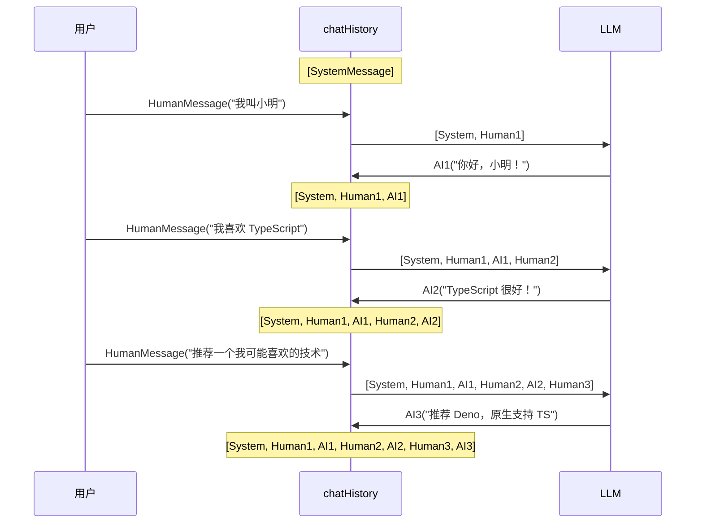

# 第7节：对话记忆 — 让 LLM 记住上下文

> LLM 本身没有记忆，"记忆"的本质是把历史消息一起发给模型。

## 简介

当你和 ChatGPT 对话时，它似乎能"记住"之前聊过的内容。但实际上，LLM（大语言模型）是**无状态**的——每一次 API 调用都是完全独立的，模型不会保留任何上一次调用的信息。

那"记忆"是怎么实现的？答案很简单：**把之前的对话消息拼接到当前的 prompt 中，一起发给模型**。模型看到的不是"记忆"，而是一段更长的上下文。所谓的"对话记忆"，不过是消息数组的不断累加。

理解这一点非常重要：你看到的 AI 助手"记住"了你的名字、你的偏好，本质上都是应用层在做消息管理，和模型本身无关。

---

## 核心概念

### LLM 是无状态的

每次调用 LLM，都是一次独立的请求-响应。模型不会记住上一次你问了什么，也不会记住你叫什么名字。如果你发送：

```
"我叫小明"
```

模型回答后，这个信息就"消失"了。下次调用时，模型完全不知道"小明"是谁。

### "记忆"的工作原理

要让模型"记住"之前的对话，你需要在每次调用时，把之前的消息也一起发过去：

```typescript
// 第1轮：发送 SystemMessage + HumanMessage
[System, Human1] → 模型 → AI1

// 第2轮：把第1轮的消息也带上
[System, Human1, AI1, Human2] → 模型 → AI2

// 第3轮：把前两轮的消息都带上
[System, Human1, AI1, Human2, AI2, Human3] → 模型 → AI3
```

消息越来越多，模型的"上下文"越来越长——这就是"记忆"的全部秘密。

### 手动管理 chatHistory

最基本的实现方式是维护一个消息数组，每次对话后追加新消息：

```typescript
import { HumanMessage, AIMessage, SystemMessage } from "@langchain/core/messages";

// 初始化：只包含系统消息
const chatHistory = [
  new SystemMessage("你是一个友好的助手，回答要简洁。"),
];

// 用户发消息后，追加到历史
chatHistory.push(new HumanMessage("我叫小明"));
chatHistory.push(new AIMessage("你好，小明！"));

// 下次调用时，把完整历史传给模型
const prompt = ChatPromptTemplate.fromMessages(chatHistory);
```

### 消息流：完整调用过程

每一轮对话的消息流如下：

```typescript
SystemMessage          // 角色设定，每轮都带上
+ [之前的对话历史...]    // 前几轮的 HumanMessage 和 AIMessage
+ 新的 HumanMessage     // 用户本轮输入
→ model.invoke()        // 发送给模型
→ AIMessage             // 模型回复
```

### 记忆策略对比

随着对话轮次增多，历史消息会越来越长，token 消耗也会越来越大。常见的三种策略：

| 策略 | 做法 | 优点 | 缺点 |
|------|------|------|------|
| 全量历史 | 发送所有历史消息 | 信息完整，不会遗忘 | token 消耗大，成本高 |
| 滑动窗口 | 只保留最近 N 轮 | 平衡成本和效果 | 早期对话会被遗忘 |
| 摘要压缩 | 把旧历史压缩成摘要 | token 效率高 | 压缩可能丢失细节 |

**全量历史**适合短对话场景（几轮以内）；**滑动窗口**是大多数应用的选择；**摘要压缩**适合长时间对话的生产环境。

### LangGraph MemorySaver

LangChain v1.x 推荐在生产环境中使用 LangGraph 的 `MemorySaver` 实现持久化记忆。它自动管理对话历史的存储和检索，无需手动维护数组：

```typescript
import { MemorySaver } from "@langchain/langgraph";

const memory = new MemorySaver();
// LangGraph 会自动在 checkpoint 中保存和恢复对话状态
```

### 历史越长，token 越多

需要特别注意：每轮对话都会增加历史消息的长度，而模型是按 token 计费的。10 轮对话的历史可能占用数千 token，100 轮对话的历史可能直接超出模型的上下文窗口限制。

因此，在实际应用中，必须考虑历史截断或压缩策略。

---

## 流程图解

### 多轮对话中消息的累积过程



每一轮对话，chatHistory 数组都会增长——这就是"记忆"的载体。

---

## 实战

完整代码见 `src/08_memory.ts`，下面分步讲解。

### 初始化 chatHistory 数组

用一个消息数组作为对话历史的载体，初始只包含 SystemMessage：

```typescript
import { HumanMessage, AIMessage, SystemMessage } from "@langchain/core/messages";
import { ChatPromptTemplate } from "@langchain/core/prompts";
import { StringOutputParser } from "@langchain/core/output_parsers";
import { createMimoModel } from "./config.js";

const model = await createMimoModel(0.7);

// 对话历史数组 —— 这就是"记忆"的载体
const chatHistory: (HumanMessage | AIMessage | SystemMessage)[] = [
  new SystemMessage("你是一个友好的助手，会记住对话历史。回答要简洁。"),
];
```

`SystemMessage` 定义了模型的角色和行为规则，每轮对话都会带上。

### 多轮对话循环

模拟三轮对话，每轮都把完整历史传给模型：

```typescript
const conversations = [
  "我叫小明，我喜欢 TypeScript",
  "我的名字是什么？",
  "推荐一个我可能会喜欢的技术",
];

for (const userMessage of conversations) {
  // 每次调用时，把完整的历史拼接到 prompt 中
  const prompt = ChatPromptTemplate.fromMessages(chatHistory);
  const chain = prompt.pipe(model).pipe(new StringOutputParser());

  console.log(`用户: ${userMessage}`);
  const reply = await chain.invoke({});
  console.log(`助手: ${reply}\n`);

  // 将本轮对话追加到历史
  chatHistory.push(new HumanMessage(userMessage));
  chatHistory.push(new AIMessage(reply));
}
```

关键点：**先用当前历史调用模型，再把新的一问一答追加到历史中**。顺序很重要——如果先追加再调用，模型会看到自己还没说过的回复。

### 查看当前对话历史

对话结束后，可以检查 chatHistory 数组的完整内容：

```typescript
console.log("=== 当前对话历史 ===");
chatHistory.forEach((msg, i) => {
  const type = msg.type;
  const content = msg.content.toString();
  const preview = content.length > 60 ? content.slice(0, 60) + "..." : content;
  console.log(`  [${i}] ${type}: ${preview}`);
});
```

输出类似：

```
[0] system: 你是一个友好的助手，会记住对话历史。回答要简洁。
[1] human: 我叫小明，我喜欢 TypeScript
[2] ai: 你好，小明！很高兴认识你...
[3] human: 我的名字是什么？
[4] ai: 你叫小明...
[5] human: 推荐一个我可能会喜欢的技术
[6] ai: 推荐 Deno，它原生支持 TypeScript...
```

可以看到，数组中的消息越来越多，模型能"看到"的上下文也越来越丰富。

---

## 运行方式

```bash
npm run 08
```

运行后会看到三轮对话的交互过程，以及最终的对话历史数组内容。

---

## 进阶补充

### 历史截断策略

当对话轮次很多时，全量历史会导致 token 消耗过高。常见的截断方式：

**1. 保留最近 N 轮（滑动窗口）**

```typescript
const MAX_TURNS = 10;
// SystemMessage 始终保留，只截断后面的对话消息
const systemMsg = chatHistory[0];
const recentHistory = chatHistory.slice(-MAX_TURNS * 2); // 每轮 2 条消息
const trimmedHistory = [systemMsg, ...recentHistory];
```

**2. 只保留 SystemMessage + 最近几条**

```typescript
const MAX_MESSAGES = 20;
if (chatHistory.length > MAX_MESSAGES) {
  const systemMsg = chatHistory[0];
  const recent = chatHistory.slice(-MAX_MESSAGES + 1);
  chatHistory.length = 0;
  chatHistory.push(systemMsg, ...recent);
}
```

### Token 计数与成本管理

不同模型对上下文长度有不同的限制（如 4K、8K、128K token）。在管理历史时，需要考虑：

- 每条消息大约占用的 token 数（中文约 1.5-2 字/token）
- 历史 + 当前输入 + 系统提示词的总 token 数不能超过模型上限
- 可以用 `tiktoken` 或模型提供商的 tokenizer 库来精确计算

### LangGraph MemorySaver

LangGraph 的 `MemorySaver` 是 LangChain 生态推荐的生产级记忆方案。它解决了手动管理 chatHistory 的痛点：自动保存对话状态、支持多用户隔离、可持久化存储。

**核心概念：Checkpoint（检查点）**

MemorySaver 基于"检查点"机制工作。每次对话的状态变化都会被保存为一个 checkpoint，就像游戏的存档点。你可以随时从任意 checkpoint 恢复对话状态。

```typescript
import { MemorySaver } from "@langchain/langgraph";

// 创建基于内存的 checkpoint 保存器
const memory = new MemorySaver();
```

**基本用法：与 StateGraph 配合**

MemorySaver 通常与 LangGraph 的 `StateGraph` 配合使用：

```typescript
import { StateGraph, MemorySaver, MessagesAnnotation } from "@langchain/langgraph";

// 定义工作流图
const workflow = new StateGraph(MessagesAnnotation)
  .addNode("agent", callModel)
  .addEdge("__start__", "agent")
  .addEdge("agent", "__end__");

// 编译图时注入 memory
const app = workflow.compile({ checkpointer: memory });

// 使用 thread_id 隔离不同对话
const config = { configurable: { thread_id: "user-123" } };

// 第1轮对话
await app.invoke(
  { messages: [{ role: "user", content: "我叫小明" }] },
  config
);

// 第2轮对话 - 自动恢复之前的上下文
const result = await app.invoke(
  { messages: [{ role: "user", content: "我叫什么？" }] },
  config
);
// 模型会回答"你叫小明"，因为 MemorySaver 自动保存了历史
```

**MemorySaver 的优势**

| 特性 | 手动管理 chatHistory | MemorySaver |
|------|---------------------|-------------|
| 状态保存 | 需要自己实现 | 自动保存到 checkpoint |
| 多用户隔离 | 需要自己维护多个数组 | 通过 thread_id 自动隔离 |
| 持久化 | 需要对接数据库 | 支持 SQLite、PostgreSQL 等 |
| 断点恢复 | 不支持 | 可从任意 checkpoint 恢复 |
| 错误回滚 | 不支持 | 可回滚到之前的状态 |

**持久化存储**

默认的 `MemorySaver` 基于内存，适合开发测试。生产环境可以使用持久化存储：

```typescript
// SQLite 持久化（适合单机部署）
import { SqliteSaver } from "@langchain/langgraph-checkpoint-sqlite";
const memory = new SqliteSaver.fromConnString("./checkpoints.db");

// PostgreSQL 持久化（适合分布式部署）
import { PostgresSaver } from "@langchain/langgraph-checkpoint-postgres";
const memory = new PostgresSaver.fromConnString(process.env.DATABASE_URL);
```

**何时使用 MemorySaver**

- 需要持久化对话历史（重启后不丢失）
- 多用户并发对话场景
- 需要实现"对话分支"或"回滚到历史版本"
- 构建复杂的 Agent 工作流（LangGraph 的核心能力）

对于简单的单用户 demo，手动管理 chatHistory 就够了。一旦进入生产环境，强烈建议使用 MemorySaver。

### 对话记忆 vs RAG 知识

初学者容易混淆"对话记忆"和"RAG 检索增强生成"，它们解决的是不同问题：

| 维度 | 对话记忆 | RAG |
|------|---------|-----|
| 目的 | 让模型记住之前的对话 | 让模型获取外部知识 |
| 数据来源 | 历史消息数组 | 外部文档/数据库 |
| 实现方式 | 拼接历史消息到 prompt | 检索相关文档后注入 prompt |
| 典型场景 | 聊天机器人、客服对话 | 知识问答、文档搜索 |

两者可以结合使用：用 RAG 检索相关知识，用对话记忆保持上下文连贯。

---

## 本节小结

- LLM 没有真正的记忆，每次调用都是独立的
- "记忆"靠把历史消息拼接到 prompt 实现
- 手动管理 chatHistory 数组是最基本的方式
- 历史越长，token 消耗越大，需要截断策略
- LangGraph 的 MemorySaver 基于 checkpoint 机制，支持自动保存、多用户隔离、持久化存储
- 生产环境推荐使用 MemorySaver + SQLite/PostgreSQL 实现持久化记忆
- 下一步预告：RAG 检索增强生成 —— 让模型拥有外部知识
