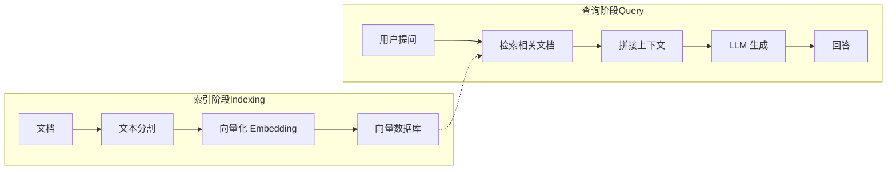

# 第8节：RAG — 让 LLM 基于你的文档回答

> RAG 是 LLM 应用最重要的模式之一，让 AI 基于你的私有知识库回答问题，而不是仅靠训练数据。

## 简介

LLM（大语言模型）拥有海量的通用知识，但存在几个根本性的局限：

- **知识截止日期**：模型的训练数据有时间限制，无法了解训练之后发生的事情。
- **幻觉问题**：当模型不确定答案时，可能会"编造"看似合理但错误的内容。
- **私有数据盲区**：模型不可能知道你公司的内部文档、产品手册、业务数据。

RAG（Retrieval-Augmented Generation，检索增强生成）正是为了解决这些问题而诞生的模式。它的核心思想非常简单：**先从你的文档中检索相关内容，再把检索到的内容和用户问题一起交给 LLM 回答**。这样一来，LLM 就能基于你的私有知识库生成准确的回答，而不是仅靠训练时学到的通用知识。

---

## 核心概念

### RAG = Retrieval-Augmented Generation

RAG 的本质是"检索 + 生成"：不让 LLM 凭空回答，而是先帮它"查资料"，再让它根据查到的资料来回答。这和人类做研究的过程类似——先翻书找相关章节，再基于找到的内容写答案。

### LLM 的困境

直接用 LLM 回答私有问题会遇到以下问题：

| 问题 | 说明 |
|------|------|
| 知识盲区 | LLM 的训练数据不包含你的私有文档 |
| 幻觉 | LLM 可能编造不存在的"事实" |
| 知识过时 | 训练截止日期之后的信息 LLM 不知道 |
| 无法溯源 | 不知道答案来自哪里，难以验证 |

RAG 通过将外部知识注入 prompt，从根本上解决了这些问题。

### RAG 工作流程

RAG 分为两个阶段：

**索引阶段（Indexing）**——离线准备：

```
原始文档 → 文本分割（chunks）→ 向量化（Embedding）→ 存入向量数据库
```

**查询阶段（Query）**——在线回答：

```
用户提问 → 向量化 → 从向量数据库检索相关文档块 → 拼接到 prompt → LLM 生成回答
```

### Document 对象

LangChain 用 `Document` 对象表示一个文档片段，包含两个核心字段：

- `pageContent`：文本内容，即文档的实际文字
- `metadata`：元数据，如来源文件名、所属主题、创建时间等

```typescript
import { Document } from "@langchain/core/documents";

const doc = new Document({
  pageContent: "TypeScript 是 JavaScript 的超集，添加了静态类型系统。",
  metadata: { source: "typescript-intro.md", topic: "TypeScript基础" },
});
```

元数据在检索时非常有用——你可以根据来源、主题等信息过滤或排序结果。

### 文本分割：RecursiveCharacterTextSplitter

为什么要分割？两个原因：

1. **LLM 上下文限制**：模型的上下文窗口有限，不能把整本书塞进去
2. **检索精度**：小块比大块更容易精准匹配用户问题

`RecursiveCharacterTextSplitter` 是 LangChain 推荐的默认分割器，它会按照分隔符层级（`\n\n`、`\n`、句号、空格）递归分割文本，尽量保持段落和句子的完整性。

```typescript
import { RecursiveCharacterTextSplitter } from "@langchain/textsplitters";

const splitter = new RecursiveCharacterTextSplitter({
  chunkSize: 200,      // 每个块最大 200 字符
  chunkOverlap: 50,    // 相邻块重叠 50 字符
});

const chunks = await splitter.splitDocuments(documents);
```

**chunkOverlap 的作用**：如果一句话刚好被切断在两个块的边界，chunkOverlap 确保相邻块有重叠区域，重要信息不会因为分割而丢失。没有 overlap 的话，检索到的块可能缺少关键的上下文。

### 检索方式

RAG 中的"检索"（Retrieval）有多种实现方式：

**关键词匹配**——简单直观，适合学习和原型验证：

```typescript
// 按关键词在文档块中查找匹配
const words = query.toLowerCase().split(/\s+/);
let score = 0;
for (const word of words) {
  if (doc.pageContent.toLowerCase().includes(word)) {
    score += 1;
  }
}
```

**向量相似度检索**——生产级方案，需要嵌入模型（Embedding Model）：

```
用户问题 → Embedding Model → 问题向量
文档块   → Embedding Model → 文档向量
计算余弦相似度 → 返回最相似的文档块
```

向量检索能理解语义——"TypeScript 的好处"和"TypeScript 有什么优势"会匹配到相同的结果，而关键词匹配做不到这一点。

### RAG 链

一个完整的 RAG 链由以下步骤组成：

```
用户问题 → 检索相关文档 → 组装上下文 → 填入 Prompt → LLM 生成 → 输出回答
```

在 LangChain 中，用 `RunnableSequence` 把这些步骤串联起来：

```typescript
const ragChain = RunnableSequence.from([
  // Step 1: 检索并组装上下文
  async (input: { question: string }) => {
    const docs = simpleRetriever(input.question);
    return {
      context: docs.map((d) => d.pageContent).join("\n\n---\n\n"),
      question: input.question,
    };
  },
  // Step 2: 填入 prompt 模板
  ragPrompt,
  // Step 3: 调用 LLM
  model,
  // Step 4: 解析输出
  new StringOutputParser(),
]);
```

Prompt 模板中包含 `{context}` 和 `{question}` 两个变量，LLM 会根据 context 来回答，而不是靠自己的"记忆"。

### RAG vs Fine-tuning

RAG 和微调（Fine-tuning）都能让 LLM 掌握私有知识，但适用场景不同：

| 维度 | RAG | Fine-tuning |
|------|-----|-------------|
| 知识更新 | 替换文档即可，实时生效 | 需要重新训练模型 |
| 成本 | 低，只需要向量数据库 | 高，需要 GPU 和训练数据 |
| 可溯源 | 可以指出答案来自哪个文档 | 难以追溯知识来源 |
| 适用场景 | 知识问答、文档搜索 | 风格迁移、特定任务优化 |
| 延迟 | 需要额外的检索步骤 | 推理时无额外开销 |

大多数场景下，RAG 是更好的起点。只有当你需要改变模型的行为风格或推理能力时，才考虑 Fine-tuning。

---

## 流程图解



索引阶段是离线的一次性准备工作，查询阶段是每次用户提问时的实时流程。向量数据库是两个阶段之间的桥梁——索引阶段写入，查询阶段读取。

---

## 实战

完整代码见 `src/09_rag.ts`，下面分步讲解。

### 创建 Document 对象

用 `Document` 构建一个模拟的知识库，包含四篇不同主题的文档：

```typescript
import { Document } from "@langchain/core/documents";

const documents = [
  new Document({
    pageContent: `TypeScript 是 JavaScript 的超集，添加了静态类型系统。
TypeScript 由微软开发和维护，最新稳定版本是 5.x。
TypeScript 代码需要编译为 JavaScript 才能在浏览器或 Node.js 中运行。
TypeScript 的主要优势包括：类型安全、更好的 IDE 支持、重构友好。`,
    metadata: { source: "typescript-intro.md", topic: "TypeScript基础" },
  }),
  new Document({
    pageContent: `LangChain 是一个用于构建 LLM 应用的框架。
LangChain 的核心概念包括：Chains（链）、Agents（代理）、Memory（记忆）、Retrieval（检索）。
LangChain 支持 Python 和 TypeScript 两个版本。
LangChain 使用 LCEL（LangChain Expression Language）来组合不同的组件。`,
    metadata: { source: "langchain-intro.md", topic: "LangChain基础" },
  }),
  new Document({
    pageContent: `RAG（Retrieval-Augmented Generation）是一种结合检索和生成的 AI 技术。
RAG 的工作流程：文档分块 → 向量化 → 存储 → 检索 → 生成回答。
RAG 的优势：减少幻觉、知识可更新、来源可追溯。
常用的向量数据库包括：Pinecone、Chroma、FAISS、pgvector。`,
    metadata: { source: "rag-intro.md", topic: "RAG技术" },
  }),
  new Document({
    pageContent: `Node.js 是一个基于 Chrome V8 引擎的 JavaScript 运行时。
Node.js 使用事件驱动、非阻塞 I/O 模型，适合高并发场景。
Node.js 的包管理器有 npm、yarn、pnpm。
Node.js 18+ 支持原生 Fetch API，Node.js 20+ 支持稳定版。`,
    metadata: { source: "nodejs-intro.md", topic: "Node.js基础" },
  }),
];
```

实际项目中，文档通常从文件、网页或数据库加载，这里手动创建便于演示。

### 文本分割

用 `RecursiveCharacterTextSplitter` 将文档分割成小块：

```typescript
import { RecursiveCharacterTextSplitter } from "@langchain/textsplitters";

const splitter = new RecursiveCharacterTextSplitter({
  chunkSize: 200,      // 每个块最大 200 字符
  chunkOverlap: 50,    // 相邻块重叠 50 字符（保持上下文连贯）
});

const splitDocs = await splitter.splitDocuments(documents);
```

分割后，4 个文档会变成更多更小的文档块。`chunkOverlap: 50` 确保相邻块有 50 个字符的重叠，避免关键信息在边界处被截断。

### 实现简单关键词检索器

本示例使用关键词匹配来演示检索逻辑，无需额外的嵌入模型：

```typescript
function simpleRetriever(query: string, topK = 2): Document[] {
  const scored = splitDocs.map((doc) => {
    const words = query.toLowerCase().split(/\s+/);
    let score = 0;
    for (const word of words) {
      if (doc.pageContent.toLowerCase().includes(word)) {
        score += 1;
      }
    }
    return { doc, score };
  });
  return scored
    .sort((a, b) => b.score - a.score)
    .slice(0, topK)
    .map((s) => s.doc);
}
```

检索器将用户问题拆成关键词，统计每个文档块包含多少个关键词，返回得分最高的 topK 个块。

### 构建 RAG 链

定义 Prompt 模板，然后用 `RunnableSequence` 组装完整的 RAG 链：

```typescript
import { ChatPromptTemplate } from "@langchain/core/prompts";
import { StringOutputParser } from "@langchain/core/output_parsers";
import { RunnableSequence } from "@langchain/core/runnables";

const ragPrompt = ChatPromptTemplate.fromTemplate(
  `你是一个知识问答助手。根据以下参考文档回答问题。
如果文档中没有相关信息，请说明你不确定。
回答要简洁准确。

参考文档:
{context}

用户问题: {question}

回答:`
);

const ragChain = RunnableSequence.from([
  async (input: { question: string }) => {
    const docs = simpleRetriever(input.question);
    return {
      context: docs.map((d) => d.pageContent).join("\n\n---\n\n"),
      question: input.question,
    };
  },
  ragPrompt,
  model,
  new StringOutputParser(),
]);
```

链的执行流程：检索文档 -> 拼接上下文 -> 填入 Prompt -> 调用模型 -> 输出字符串。

### 测试多个问题

```typescript
const questions = [
  "TypeScript 有什么优势？",
  "RAG 是什么？它怎么工作？",
  "LangChain 的核心概念有哪些？",
  "Python 和 JavaScript 哪个更好？", // 知识库中可能没有相关信息
];

for (const question of questions) {
  console.log(`Q: ${question}`);
  const answer = await ragChain.invoke({ question });
  console.log(`A: ${answer}\n`);
}
```

前三个问题都能从知识库中检索到相关文档，模型会基于文档内容回答。第四个问题在知识库中没有直接相关的信息，模型会诚实地表示不确定——这正是 RAG 的价值：**让模型知道自己不知道什么**。

### 使用本地 Ollama 向量模型（语义检索）

关键词检索只能匹配字面相同的词，无法理解语义。比如搜"好处"匹配不到"优势"，搜"TS"匹配不到"TypeScript"。

向量检索通过 Embedding 模型把文本转换成向量（一串数字），语义相近的文本向量也相近，从而实现语义级别的匹配。

**准备工作**：

确保本地已安装并启动 Ollama，然后拉取向量模型：

```bash
ollama pull qwen3-embedding:4b
```

**创建向量存储和检索器**：

```typescript
import { OllamaEmbeddings } from "@langchain/ollama";
import { MemoryVectorStore } from "@langchain/classic/vectorstores/memory";

// 创建 Ollama Embedding 模型
const embeddings = new OllamaEmbeddings({
  model: "qwen3-embedding:4b",        // 使用本地的向量模型
  baseUrl: "http://localhost:11434",  // Ollama 默认地址
});

// 创建向量存储（会调用 Ollama 将文档转为向量）
// MemoryVectorStore 是内存数据库，适合学习和小规模数据
// 生产环境可用 Pinecone、Chroma、FAISS 等专业向量数据库
const vectorStore = await MemoryVectorStore.fromDocuments(splitDocs, embeddings);

// 创建向量检索器，k=2 表示返回最相似的 2 个文档
const vectorRetriever = vectorStore.asRetriever({ k: 2 });
```

**使用向量检索器构建 RAG 链**：

```typescript
const vectorRagChain = RunnableSequence.from([
  async (input: { question: string }) => {
    const docs = await vectorRetriever.invoke(input.question);
    return {
      context: docs.map((d: Document) => d.pageContent).join("\n\n---\n\n"),
      question: input.question,
    };
  },
  ragPrompt,
  model,
  new StringOutputParser(),
]);
```

**对比两种检索方式**：

用同一个问题测试关键词检索和向量检索：

```typescript
const compareQuery = "TS 有什么好处？";  // 使用缩写"TS"而不是"TypeScript"

// 关键词检索：找不到，因为文档中没有"TS"这个词
const keywordDocs = simpleRetriever(compareQuery);

// 向量检索：能找到，因为模型理解"TS"是"TypeScript"的缩写
const semanticDocs = await vectorRetriever.invoke(compareQuery);
```

向量检索的优势：
- **语义理解**："好处"能匹配到"优势"，"TS"能匹配到"TypeScript"
- **多语言支持**：中文问题能匹配英文文档
- **更精准**：理解句子含义，而不是简单关键词匹配

---

## 运行方式

```bash
npm run 09
```

运行后会依次输出文档信息、分割结果、以及四个问题的 RAG 回答。

---

## 进阶补充

### 向量数据库

生产环境中，需要用向量数据库来存储和检索文档向量：

| 向量数据库 | 特点 |
|-----------|------|
| Pinecone | 云托管，开箱即用，免运维 |
| Chroma | 轻量级，支持本地运行，适合开发和原型 |
| FAISS | Facebook 开源，高性能，适合大规模数据 |
| pgvector | PostgreSQL 扩展，适合已有 PG 基础设施的团队 |

### Embedding 模型

向量化需要 Embedding 模型，常见的选择：

- **OpenAI Embeddings**：`text-embedding-3-small` / `text-embedding-3-large`，效果好，需要 API 调用
- **Cohere Embed**：多语言支持优秀
- **本地模型**：如 `all-MiniLM-L6-v2`（通过 HuggingFace），无需网络，隐私性好
- **Ollama 本地模型**：支持 `qwen3-embedding:4b`、`nomic-embed-text` 等，完全离线运行，数据不出本机

### RAG 评估指标

衡量 RAG 系统质量的关键指标：

- **检索准确率（Recall）**：相关文档是否被检索到
- **回答忠实度（Faithfulness）**：回答是否基于检索到的文档，而非模型自己的"幻觉"
- **回答相关度（Relevancy）**：回答是否真正回答了用户的问题

### 高级 RAG 技术

基础 RAG 在简单场景下表现良好，生产环境可以引入更高级的技术：

- **Re-ranking**：对检索结果重新排序，把最相关的排到最前面
- **Query Transformation**：改写用户问题（如分解成多个子问题），提高检索命中率
- **Hybrid Search**：结合关键词搜索和向量搜索，取两者之长

---

## 本节小结

- RAG 让 LLM 基于你的私有文档回答问题，而不是仅靠训练数据
- 文档需要分块才能高效检索，`RecursiveCharacterTextSplitter` 是推荐的默认分割器
- `chunkOverlap` 保持上下文连贯，避免关键信息在分割边界处丢失
- 关键词检索简单但有限，只能匹配字面相同的词
- 向量检索通过 Embedding 模型实现语义理解，是生产环境的首选方案
- 本地 Ollama 模型（如 `qwen3-embedding:4b`）可实现完全离线的向量检索
- RAG 链 = 检索 + 拼接上下文 + Prompt + LLM 生成
- 生产环境需要向量数据库（如 Pinecone、Chroma）和嵌入模型（如 OpenAI Embeddings）
- 下一步预告：中间件与回调 —— 监控和调试 LLM 应用的利器
