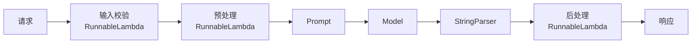

# 第9节：进阶 -- 中间件、回调与生产实践

> 回调系统是 LangChain 的"中间件"机制，让你在链的生命周期中插入自定义逻辑。

## 简介

到目前为止，我们已经学会了如何构建链、调用工具、管理记忆。但在生产环境中，光有"能跑"的链是不够的——你还需要：

- **日志记录**：每次链执行时，记录输入、输出和耗时，方便排查问题
- **性能监控**：追踪 LLM 调用的 token 消耗和响应时间
- **输入校验**：在请求到达模型之前，拦截不合法的输入
- **输出格式化**：在返回给用户之前，对模型输出做统一处理

这些问题的共同点是：你需要在链的**生命周期**中插入自定义逻辑。这就是"中间件"和"回调"要解决的问题。

LangChain 的回调系统提供了标准化的生命周期钩子，让你能在链执行的各个阶段（开始、结束、出错）插入自定义代码，而不需要修改链本身的核心逻辑。

---

## 核心概念

### 回调系统：LangChain 的生命周期钩子

LangChain 的链在执行过程中会触发一系列事件。你可以注册"监听器"来响应这些事件，就像 Express 中的中间件一样：

```
请求进入 → [回调: 记录开始时间] → 链执行 → [回调: 记录耗时] → 响应返回
```

这些监听器就是"回调处理器"（Callback Handler）。

### BaseCallbackHandler：类继承方式

最正式的写法是继承 `BaseCallbackHandler`，重写你关心的生命周期方法：

```typescript
import { BaseCallbackHandler } from "@langchain/core/callbacks/base";
```

常用的生命周期方法：

| 方法 | 触发时机 | 典型用途 |
|------|---------|---------|
| `handleChainStart` | 链开始执行 | 记录输入、开始计时 |
| `handleChainEnd` | 链执行完成 | 记录输出、计算耗时 |
| `handleLLMStart` | LLM 调用开始 | 记录模型名称 |
| `handleLLMEnd` | LLM 调用完成 | 统计 token 用量 |
| `handleChainError` | 链执行出错 | 错误上报、告警 |

### 注入回调

回调通过 `invoke` 方法的第二个参数注入，不会改变链本身的代码：

```typescript
await chain.invoke(input, { callbacks: [new MyCallbackHandler()] });
```

`callbacks` 接受一个数组，可以同时注入多个回调处理器。

### BaseCallbackHandler.fromMethods()：函数式快捷方式

不想写一个完整的类时，可以用 `fromMethods()` 快速创建回调：

```typescript
const handler = BaseCallbackHandler.fromMethods({
  handleChainStart(_chain, _inputs, runId) {
    console.log("开始:", runId);
  },
  handleChainEnd(_outputs, runId) {
    console.log("结束:", runId);
  },
});
```

适合简单的日志、计时等场景，不需要定义类。

### RunnableLambda：把函数变成链的一环

`RunnableLambda` 让你把一个普通的函数包装成 LCEL 链的一个环节，可以插入到链的任意位置：

```typescript
import { RunnableLambda } from "@langchain/core/runnables";

// 输入预处理
const preprocess = RunnableLambda.from((input: { text: string }) => {
  return { text: input.text.trim().toLowerCase() };
});

// 输出后处理
const postprocess = RunnableLambda.from((output: string) => {
  return `结果: ${output}`;
});
```

常见用途：
- **输入校验**：在链的最前面拦截不合法输入
- **输入增强**：给输入添加额外上下文或元数据
- **输出格式化**：统一输出格式，添加时间戳等
- **输出包装**：把纯文本包装成结构化对象

### 多回调叠加

可以同时注入多个回调，它们按注册顺序依次执行：

```typescript
await chain.invoke(input, {
  callbacks: [loggingHandler, timingHandler, monitorHandler],
});
```

每个回调独立运行，互不干扰。一个回调的异常不会影响其他回调的执行。

---

## 流程图解

### 带中间件的链执行流程



数据从左到右流经每一层，每一层只负责自己的职责——校验、增强、生成、解析、格式化，各司其职。

---

## 实战

完整代码见 `src/11_middleware.ts`，下面分步讲解。

### 1. 自定义回调处理器（类继承方式）

定义一个日志回调，记录链和 LLM 的完整执行过程：

```typescript
import { BaseCallbackHandler } from "@langchain/core/callbacks/base";
import { ChatPromptTemplate } from "@langchain/core/prompts";
import { StringOutputParser } from "@langchain/core/output_parsers";
import { RunnableLambda, RunnableSequence } from "@langchain/core/runnables";
import type { Serialized } from "@langchain/core/load/serializable";
import type { ChainValues } from "@langchain/core/utils/types";
import type { LLMResult } from "@langchain/core/outputs";
import { createMimoModel } from "./config.js";

class LoggingCallbackHandler extends BaseCallbackHandler {
  name = "LoggingCallbackHandler";

  // 链开始时触发
  handleChainStart(chain: Serialized, inputs: ChainValues) {
    console.log(`  [日志] 链开始: ${chain.id?.join(".") || "unknown"}`);
    console.log(`  [日志]    输入:`, JSON.stringify(inputs).slice(0, 100));
  }

  // 链结束时触发
  handleChainEnd(outputs: ChainValues) {
    console.log(`  [日志] 链结束`);
    console.log(`  [日志]    输出:`, JSON.stringify(outputs).slice(0, 100));
  }

  // LLM 调用开始
  handleLLMStart(llm: Serialized) {
    console.log(`  [日志] LLM 调用开始: ${llm.id?.join(".") || "unknown"}`);
  }

  // LLM 调用结束
  handleLLMEnd(output: LLMResult) {
    const tokenUsage = output.llmOutput?.tokenUsage;
    if (tokenUsage) {
      console.log(`  [日志] LLM 调用结束 - tokens: ${tokenUsage.totalTokens}`);
    } else {
      console.log(`  [日志] LLM 调用结束`);
    }
  }

  // 错误处理
  handleChainError(err: Error) {
    console.log(`  [日志] 链错误: ${err.message}`);
  }
}
```

通过 `invoke` 的第二个参数注入回调：

```typescript
const prompt = ChatPromptTemplate.fromTemplate("用一句话解释：{concept}");
const model = await createMimoModel(0.5);
const chain = prompt.pipe(model).pipe(new StringOutputParser());

const result = await chain.invoke(
  { concept: "闭包（Closure）" },
  { callbacks: [new LoggingCallbackHandler()] }
);
```

运行后，你会看到链和 LLM 每个阶段的输入、输出和 token 消耗都被记录下来。

### 2. 函数式回调（fromMethods）

不想写类时，用 `BaseCallbackHandler.fromMethods()` 更简洁：

```typescript
const timingHandler = BaseCallbackHandler.fromMethods({
  handleChainStart(_chain, _inputs, runId) {
    console.log(`  [计时] 开始 - runId: ${runId.slice(0, 8)}...`);
    (globalThis as any).__chainStartTime = Date.now();
  },
  handleChainEnd(_outputs, runId) {
    const elapsed = Date.now() - ((globalThis as any).__chainStartTime || Date.now());
    console.log(`  [计时] 结束 - runId: ${runId.slice(0, 8)}... 耗时: ${elapsed}ms`);
  },
});

const result = await chain.invoke(
  { concept: "递归" },
  { callbacks: [timingHandler] }
);
```

这种方式适合快速原型和简单场景，不需要定义完整的类。

### 3. RunnableLambda 中间件

把普通函数变成链的一环，实现输入预处理和输出后处理：

```typescript
// 中间件 1: 输入预处理（清理空白、添加上下文）
const enrichInput = RunnableLambda.from((input: { question: string }) => {
  console.log(`  [中间件-预处理] 原始输入: "${input.question}"`);
  return {
    ...input,
    question: input.question.trim(),
  };
});

// 中间件 2: 输出后处理（格式化）
const formatOutput = RunnableLambda.from((output: string) => {
  console.log(`  [中间件-后处理] 原始输出长度: ${output.length} 字符`);
  return `${output.trim()}`;
});
```

组装带中间件的链：

```typescript
const middlewareModel = await createMimoModel(0.5);
const middlewareChain = RunnableSequence.from([
  enrichInput,                                            // 预处理
  ChatPromptTemplate.fromTemplate("用一句话简洁回答：{question}"),
  middlewareModel,                                         // 模型调用
  new StringOutputParser(),                                // 输出解析
  formatOutput,                                            // 后处理
]);

const result = await middlewareChain.invoke({ question: "  什么是微服务架构？  " });
```

注意输入有首尾空格，`enrichInput` 会在进入 Prompt 之前自动清理。

### 4. 性能监控中间件（综合示例）

将回调和 RunnableLambda 组合，实现一个完整的监控方案：

```typescript
// 通用性能回调
class PerformanceMonitor extends BaseCallbackHandler {
  name = "PerformanceMonitor";
  private timings: Map<string, number> = new Map();
  private callCount = 0;

  handleChainStart(_chain: Serialized, _inputs: ChainValues, runId: string) {
    this.timings.set(runId, Date.now());
    this.callCount++;
  }

  handleChainEnd(_outputs: ChainValues, runId: string) {
    const start = this.timings.get(runId);
    if (start) {
      const elapsed = Date.now() - start;
      console.log(`  [监控] 链执行耗时: ${elapsed}ms`);
      this.timings.delete(runId);
    }
  }

  handleLLMStart() {
    this.callCount++;
  }

  getStats() {
    return { totalCalls: this.callCount };
  }
}
```

输入校验中间件——在链的入口拦截不合法输入：

```typescript
const validateInput = RunnableLambda.from((input: { topic: string }) => {
  if (!input.topic || input.topic.trim().length === 0) {
    throw new Error("topic 不能为空");
  }
  if (input.topic.length > 200) {
    throw new Error("topic 过长，最多 200 字符");
  }
  return input;
});
```

响应包装中间件——把纯文本包装成结构化对象：

```typescript
const wrapResponse = RunnableLambda.from((output: string) => {
  return {
    answer: output.trim(),
    timestamp: new Date().toISOString(),
    source: "mimo-v2.5-pro",
  };
});
```

把所有中间件组装成一条完整的链：

```typescript
const monitor = new PerformanceMonitor();
const monitoredModel = await createMimoModel(0.5);

const monitoredChain = RunnableSequence.from([
  validateInput,                                           // 校验
  ChatPromptTemplate.fromTemplate("简要介绍：{topic}"),
  monitoredModel,                                          // 模型
  new StringOutputParser(),                                // 解析
  wrapResponse,                                            // 包装
]);

const result = await monitoredChain.invoke(
  { topic: "Rust 语言的所有权机制" },
  { callbacks: [monitor] }
);
console.log("监控结果:", JSON.stringify(result, null, 2));
console.log("统计信息:", monitor.getStats());
```

最终输出是一个结构化对象：

```json
{
  "answer": "Rust 的所有权机制是...",
  "timestamp": "2026-08-25T12:00:00.000Z",
  "source": "mimo-v2.5-pro"
}
```

### 5. 多回调叠加

可以同时注入多个回调，它们按注册顺序执行：

```typescript
const result = await chain.invoke(
  { concept: "依赖注入" },
  {
    callbacks: [
      new LoggingCallbackHandler(),   // 第1个：日志
      timingHandler,                  // 第2个：计时
      monitor,                        // 第3个：性能监控
    ],
  }
);
console.log("总调用次数:", monitor.getStats().totalCalls);
```

三个回调各自独立运行，日志回调记录过程，计时回调计算耗时，性能监控回调统计调用次数。它们互不影响。

---

## 运行方式

```bash
npm run 11
```

运行后会依次看到 5 个示例的输出：类继承回调、函数式回调、RunnableLambda 中间件、综合监控、多回调叠加。

---

## 进阶补充

### 与 Express/Koa 中间件的对比

如果你有 Web 后端经验，会发现 LangChain 的回调和 RunnableLambda 与 Express/Koa 的中间件模式很相似：

| 维度 | Express/Koa 中间件 | LangChain 回调/中间件 |
|------|-------------------|---------------------|
| 执行模型 | 洋葱模型：请求穿过中间件，响应原路返回 | 回调在生命周期钩子中触发；RunnableLambda 按管道顺序执行 |
| 注入方式 | `app.use(middleware)` 全局注册 | `{ callbacks: [...] }` 按调用注入 |
| 前后处理 | 同一个中间件可以同时处理请求和响应 | 回调的 handleChainStart / handleChainEnd 分别处理 |
| 数据流向 | 请求和响应都经过中间件 | RunnableLambda 只处理数据的单向传递 |
| 错误处理 | `next(err)` 传递错误 | `handleChainError` 专门的错误钩子 |

核心思想一致：**把横切关注点（日志、监控、校验）从核心业务逻辑中分离出来**。

### AsyncLocalStorage：请求级上下文（进阶）

在 Node.js 中，如果你的服务同时处理多个请求，可能需要在回调中访问当前请求的上下文（如用户 ID、请求 ID）。Node.js 的 `AsyncLocalStorage` 可以解决这个问题：

```typescript
import { AsyncLocalStorage } from "async_hooks";

const requestContext = new AsyncLocalStorage<{ requestId: string; userId: string }>();

// 在请求入口设置上下文
app.post("/chat", (req, res) => {
  requestContext.run({ requestId: req.id, userId: req.user.id }, async () => {
    const result = await chain.invoke(input, { callbacks: [handler] });
    res.json(result);
  });
});

// 在回调中访问上下文
class ContextAwareCallback extends BaseCallbackHandler {
  name = "ContextAwareCallback";

  handleChainStart() {
    const ctx = requestContext.getStore();
    console.log(`[${ctx?.requestId}] 链开始执行`);
  }
}
```

这让每个请求的回调都能访问自己的上下文，即使多个请求并发执行也不会混淆。

### 生产实践建议

在生产环境中使用回调系统时，建议关注以下几点：

**错误边界**：回调中的异常不应中断链的执行。使用 try/catch 包裹回调逻辑：

```typescript
class SafeCallback extends BaseCallbackHandler {
  name = "SafeCallback";

  handleChainStart(chain: Serialized, inputs: ChainValues) {
    try {
      // 监控逻辑
    } catch (err) {
      console.error("回调异常，不影响链执行:", err);
    }
  }
}
```

**重试逻辑**：LLM 调用可能因网络或限流失败。LangChain 内置了重试支持：

```typescript
const model = await createMimoModel(0.5);
// 通过 bind 方法配置重试（模型层重试）
// 或在链级别使用 RunnableRetry
```

**限流控制**：避免并发请求过多导致 API 限流：

```typescript
import { RunnableConfig } from "@langchain/core/runnables";

// 通过 maxConcurrency 控制并发
const config: RunnableConfig = {
  maxConcurrency: 5,
};
await chain.invoke(input, config);
```

### LangSmith：LLM 应用的可观测性平台

在生产环境中，你需要知道每次 LLM 调用发生了什么：输入是什么、输出是什么、耗时多久、token 消耗多少、哪一步出了错。这就是 **LangSmith** 要解决的问题。

**LangSmith 是什么**

LangSmith 是 LangChain 官方提供的可观测性（Observability）平台，专门为 LLM 应用设计。它提供：

| 功能 | 说明 |
|------|------|
| **Tracing（链路追踪）** | 记录每次链/Agent 执行的完整调用链，包括每个组件的输入、输出、耗时 |
| **Evaluation（评估）** | 对 LLM 输出进行质量评估，支持自动评估和人工评估 |
| **Datasets（数据集）** | 管理测试数据集，用于回归测试和性能基准 |
| **Monitoring（监控）** | 实时监控生产环境的 LLM 调用，设置告警规则 |
| **Debugging（调试）** | 在 Web 界面中查看每一步的详细执行过程，快速定位问题 |

**为什么需要 LangSmith**

自建回调系统可以实现基本的日志和监控，但面对复杂场景会力不从心：

```
链执行失败 → 哪一步出错了？
响应质量下降 → 是 prompt 改了还是模型变了？
token 消耗异常 → 哪些请求消耗最多？
用户反馈错误 → 能否复现当时的调用过程？
```

LangSmith 提供了一个完整的 Web 界面来回答这些问题，而不需要你自己搭建日志系统。

**快速接入**

接入 LangSmith 非常简单，只需要设置两个环境变量：

```bash
# .env
LANGCHAIN_TRACING_V2=true
LANGCHAIN_API_KEY=your-langsmith-api-key
```

设置后，LangChain 会自动将所有调用记录发送到 LangSmith，**无需修改任何代码**。

```typescript
// 以下代码不需要任何改动，LangSmith 会自动追踪
import { ChatPromptTemplate } from "@langchain/core/prompts";
import { StringOutputParser } from "@langchain/core/output_parsers";
import { createMimoModel } from "./config.js";

const model = await createMimoModel(0.7);
const chain = ChatPromptTemplate.fromTemplate("解释：{concept}")
  .pipe(model)
  .pipe(new StringOutputParser());

// 这次调用会自动出现在 LangSmith 的 Trace 界面中
const result = await chain.invoke({ concept: "闭包" });
```

**Tracing 界面示例**

在 LangSmith 的 Web 界面中，你可以看到：

```
Trace: chain.invoke({ concept: "闭包" })
├── ChatPromptTemplate.format()           → 2ms
├── ChatOpenAI.invoke()                   → 1.2s
│   ├── Input: [SystemMessage, HumanMessage]
│   ├── Output: AIMessage("闭包是...")
│   └── Tokens: 45 input + 120 output
└── StringOutputParser.parse()            → 0ms
```

每个步骤的输入、输出、耗时一目了然。

**适用场景**

- 开发阶段：调试复杂的链和 Agent，查看每一步的中间结果
- 测试阶段：用 Datasets 做回归测试，确保 prompt 修改不会降低质量
- 生产阶段：监控 token 消耗、响应时间、错误率
- 团队协作：共享 trace 链接，方便讨论和排查问题

**与自建回调的关系**

LangSmith 和自建回调系统不冲突：

- **LangSmith**：提供开箱即用的 Web 界面和分析能力，适合快速接入
- **自建回调**：适合需要将日志写入自己的系统（如 ELK、Datadog）的场景

两者可以同时使用，互不影响。

### LangGraph：复杂 Agent 工作流

当你需要构建更复杂的 Agent（多步骤推理、条件分支、人工介入）时，推荐使用 LangGraph。它建立在 LangChain 之上，提供了基于图的工作流编排能力：

```typescript
// LangGraph 示例（概念性代码）
import { StateGraph, MemorySaver } from "@langchain/langgraph";

// 定义状态和节点
// 节点之间通过边连接，支持条件分支
// 内置 checkpoint 和人工介入能力
```

LangGraph 适合以下场景：
- 多步骤的 Agent 推理链
- 需要条件分支和循环的工作流
- 需要人工审核或介入的流程
- 需要持久化状态的长时间运行任务

---

## 本节小结

- `BaseCallbackHandler` 提供链和 LLM 的生命周期钩子
- 通过 `{ callbacks: [...] }` 注入回调，不改变链本身的代码
- `RunnableLambda` 把普通函数变成链的一环，适合输入校验、输出格式化等
- 中间件模式让链的每一层职责清晰，横切关注点从业务逻辑中分离
- 回调可以叠加，按注册顺序执行，各回调独立运行
- LangSmith 是 LangChain 官方的可观测性平台，只需设置环境变量即可自动追踪所有调用
- 生产环境要注意错误边界、重试和限流

恭喜完成全部教程！你已经掌握了 LangChain TypeScript 的核心概念与实战技巧。接下来可以探索 LangGraph 构建更复杂的 Agent 工作流，或者将所学应用到实际项目中。
