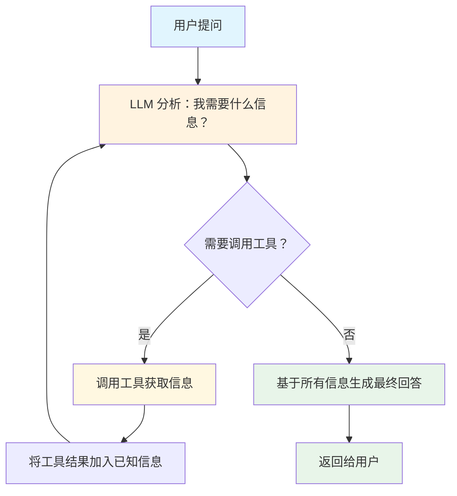
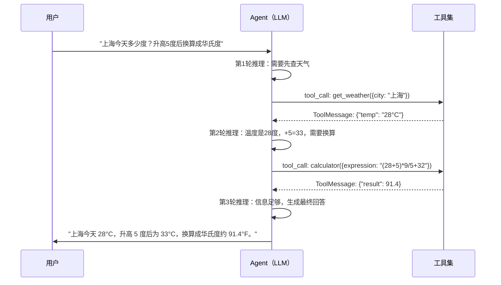
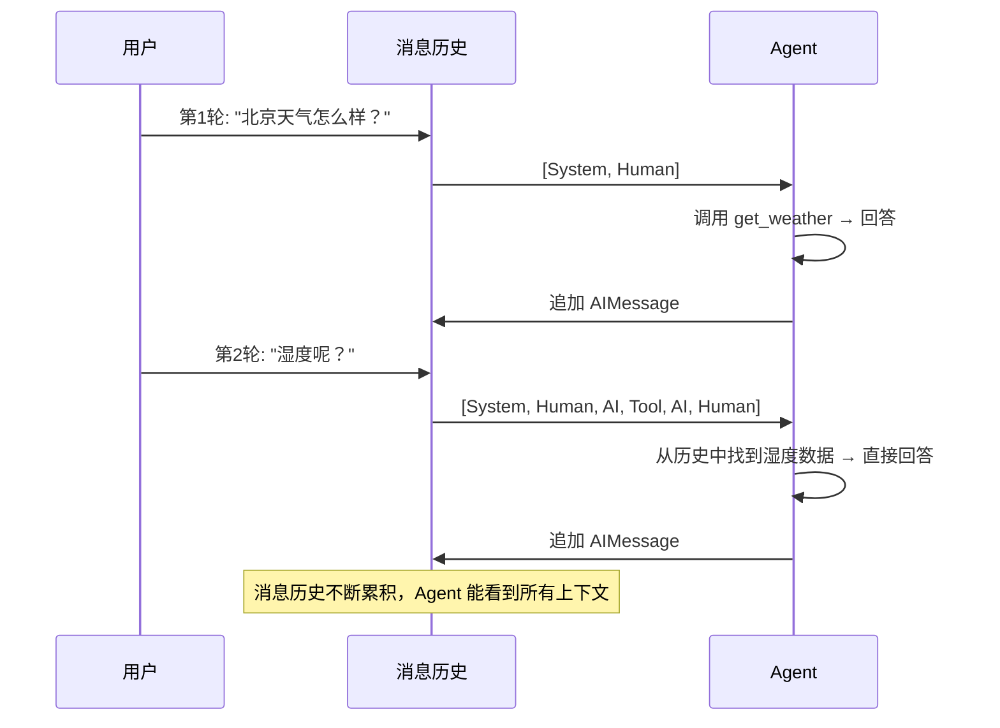
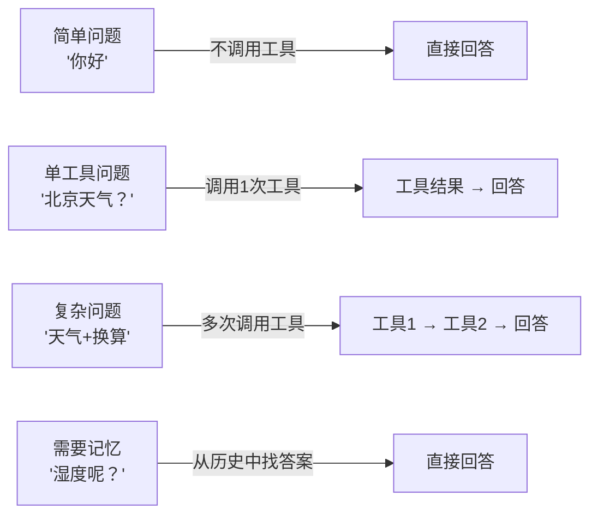

# 第10节：智能代理 — 让 LLM 自主规划和行动

> Agent 是 LangChain 中最强大的应用模式：让 LLM 不再只是"回答问题"，而是能自主规划步骤、调用工具、多步推理，最终完成复杂任务。

## 简介

到目前为止，我们已经学会了用 LLM 生成文本、用工具调用扩展 LLM 的能力、用 ReAct 循环让 LLM 多次调用工具。但这些都是"你手动编排好流程，LLM 按步骤执行"。

**Agent（智能代理）** 则更进一步——你只需要告诉 LLM "有哪些工具可用"和"你的目标是什么"，**LLM 自己决定怎么做**。

打个比方：

| 模式 | 比喻 | 特点 |
|------|------|------|
| 普通链 (Chain) | 按菜谱做菜 | 流程固定，开发者预设每一步 |
| Agent | 请一位厨师自由发挥 | 流程动态，LLM 根据情况自主决策 |

Agent 的核心公式：

```
Agent = LLM + Tools + Loop（循环控制） + System Prompt（行为规范）
```

- **LLM**：决策大脑，分析问题、选择工具、规划步骤
- **Tools**：执行能力，让 LLM 能与外部世界交互
- **Loop**：循环控制，让 LLM 能多次调用工具直到完成任务
- **System Prompt**：行为规范，告诉 LLM 它的角色和行为准则

## 核心概念

### Agent 与 Chain 的区别

理解 Agent 和 Chain 的区别是学习 Agent 的第一步。

**Chain（链）** 的流程是开发者预先设计好的：

```
用户输入 → Prompt模板 → LLM → 输出解析器 → 结果
```

每一步都是固定的。不管用户问什么，数据都按同样的路径流动。这适合"翻译"、"摘要"等流程明确的任务。

**Agent（代理）** 的流程是 LLM 运行时动态决定的：

```
用户输入 → LLM 分析 → "我需要查天气" → 调用天气工具 → LLM 再分析 → "还需要计算" → 调用计算器 → LLM 总结 → 结果
```

LLM 自己决定"要不要调用工具"、"调用哪个工具"、"调用几次"。这适合需要灵活决策的复杂任务。

### ReAct：Agent 的思考方式

Agent 的核心工作模式叫做 **ReAct**（**Re**asoning + **Act**ing），即"推理-行动"循环：

1. **Reasoning（推理）**：LLM 分析当前情况，思考"我现在知道什么？还需要什么？"
2. **Acting（行动）**：LLM 决定调用某个工具来获取缺失的信息
3. **Observing（观察）**：工具返回结果，LLM 将结果纳入已知信息
4. **循环**：回到第 1 步，直到 LLM 认为信息足够，可以给出最终回答



这个循环的关键在于：**每次迭代中，LLM 都能看到完整的消息历史**（包括之前的工具调用和结果），所以它能基于所有已知信息做出下一步决策。

### System Prompt：Agent 的"人格"

System Prompt 是 Agent 的行为规范。它不回答用户的问题，而是告诉 LLM：

- **你是谁**：你是一个智能助手 / 数据分析师 / 客服机器人
- **你该怎么做**：先思考再行动、不确定时反问、回答要简洁
- **工具怎么用**：什么场景用什么工具

一个好的 System Prompt 能显著提升 Agent 的表现。来看一个例子：

```typescript
// 来源：src/12_agent.ts — AGENT_SYSTEM_PROMPT 常量
const AGENT_SYSTEM_PROMPT = `你是一个智能助手 Agent，擅长利用各种工具帮助用户解决问题。

## 行为准则
1. **先思考再行动**：收到问题后，先分析是否需要调用工具，不要盲目调用
2. **按需调用**：只在确实需要时才调用工具，简单问题直接回答
3. **准确选工具**：根据问题类型选择最合适的工具
4. **组合使用**：复杂问题可能需要多次调用不同工具，逐步获取信息
5. **总结回答**：工具执行完毕后，用自然语言总结结果，不要直接输出 JSON`;
```

> 以上代码片段来自 [`src/12_agent.ts`](../src/12_agent.ts)，定义了 Agent 的系统提示词，规范了 Agent 的思考和行动方式。

### 工具定义：Agent 的"能力"

Agent 需要工具才能与外部世界交互。工具的定义质量直接影响 Agent 的表现。

每个工具包含三个关键部分：

| 部分 | 作用 | 重要性 |
|------|------|--------|
| `name` | 工具名称，LLM 用它来引用工具 | 名称要简洁明确 |
| `description` | 工具描述，LLM 根据描述决定何时使用 | **最重要的部分**，描述越清晰，LLM 选择越准确 |
| `schema` | 参数定义，告诉 LLM 需要传什么参数 | 用 `.describe()` 给每个参数加说明 |

以代码文件中的计算器工具为例：

```typescript
// 来源：src/12_agent.ts — calculatorTool 定义
const calculatorTool = tool(
  async ({ expression }) => {
    try {
      const result = Function(`"use strict"; return (${expression})`)();
      return JSON.stringify({ expression, result });
    } catch {
      return JSON.stringify({ error: `无法计算表达式: ${expression}` });
    }
  },
  {
    name: "calculator",
    description:
      "数学计算器。输入数学表达式（如 '2+3*4'、'100/3'、'2**10'），返回计算结果。" +
      "适用于所有需要数值计算的场景。",
    schema: z.object({
      expression: z
        .string()
        .describe("数学表达式，如 2+3*4, 100/3.14, 2**10"),
    }),
  }
);
```

> 以上代码片段来自 [`src/12_agent.ts`](../src/12_agent.ts)，定义了一个数学计算器工具。`description` 字段清楚说明了工具的用途和适用场景，`schema` 中的 `.describe()` 告诉 LLM 参数的格式。

**工具描述的黄金法则**：

- 不好的描述：`"一个计算工具"` — LLM 不知道它能算什么
- 好的描述：`"数学计算器。输入数学表达式（如 '2+3*4'），返回计算结果。适用于所有需要数值计算的场景。"` — LLM 能准确判断何时使用

### 消息类型：Agent 的"记忆载体"

Agent 的整个思考过程都记录在消息列表中。理解消息类型是理解 Agent 工作原理的基础：

| 消息类型 | 角色 | 内容示例 |
|----------|------|----------|
| `SystemMessage` | 系统指令 | Agent 的行为规范 |
| `HumanMessage` | 用户输入 | "北京今天天气怎么样？" |
| `AIMessage` | 模型回复（含 tool_calls） | 决定调用 `get_weather` |
| `ToolMessage` | 工具执行结果 | `{"city":"北京","temperature":"25°C"}` |

一条完整的 Agent 消息历史看起来是这样的：

```
[SystemMessage]  你是一个智能助手...
[HumanMessage]   北京今天天气怎么样？
[AIMessage]      tool_calls: [{name: "get_weather", args: {city: "北京"}}]
[ToolMessage]    {"city":"北京","temperature":"25°C","condition":"晴"}
[AIMessage]      北京今天天气晴朗，气温 25°C，适合出行。
```

每次循环中，LLM 都能看到完整的消息历史，这就是它能"记住"之前做了什么的关键。

### Agent 带对话记忆

单次问答的 Agent 每次都是独立的——不记得之前聊过什么。但在实际应用中（如聊天机器人、客服系统），我们需要 Agent 能记住对话历史，实现连贯的多轮交互。

实现方式很简单：**维护一个持久的消息列表**，每轮对话后将用户消息和 Agent 回复都追加到列表中。

```typescript
// 来源：src/12_agent.ts — AgentWithMemory 类（简化示意）
class AgentWithMemory {
  private messages: BaseMessage[];

  constructor(systemPrompt: string) {
    this.messages = [new SystemMessage(systemPrompt)];
  }

  async chat(question: string): Promise<string> {
    // 1. 将用户消息追加到历史
    this.messages.push(new HumanMessage(question));

    // 2. 运行 ReAct 循环（传入完整历史）
    const answer = await runReActLoop([...this.messages]);

    // 3. 将 Agent 回复追加到历史
    this.messages.push(new AIMessage(answer));

    return answer;
  }
}
```

> 以上代码片段来自 [`src/12_agent.ts`](../src/12_agent.ts)，展示了带对话记忆的 Agent 实现。核心是维护一个 `messages` 数组，每次调用时传入完整历史。

这样 Agent 在第 3 轮对话时，仍然能看到第 1 轮的天气信息，实现连贯交互。

## 流程图解

### Agent 单次问答流程



### Agent 多轮对话流程



### 不同场景的 Agent 行为



## 实战

完整代码见 [`src/12_agent.ts`](../src/12_agent.ts)，下面分步讲解。

### 1. 定义工具集

Agent 的工具集决定了它的"能力边界"。示例中定义了 5 个工具：

```typescript
// 来源：src/12_agent.ts — 工具定义部分
import { z } from "zod";
import { tool } from "@langchain/core/tools";

// 工具 1：数学计算器
const calculatorTool = tool(
  async ({ expression }) => {
    try {
      const result = Function(`"use strict"; return (${expression})`)();
      return JSON.stringify({ expression, result });
    } catch {
      return JSON.stringify({ error: `无法计算表达式: ${expression}` });
    }
  },
  {
    name: "calculator",
    description: "数学计算器。输入数学表达式，返回计算结果。",
    schema: z.object({
      expression: z.string().describe("数学表达式，如 2+3*4"),
    }),
  }
);

// 工具 2：天气查询（模拟数据）
const weatherTool = tool(
  async ({ city }) => {
    const mockWeather: Record<string, { temp: number; condition: string; humidity: number }> = {
      北京: { temp: 25, condition: "晴", humidity: 40 },
      上海: { temp: 28, condition: "多云", humidity: 65 },
      深圳: { temp: 30, condition: "阵雨", humidity: 80 },
    };
    const data = mockWeather[city];
    if (data) {
      return JSON.stringify({ city, temperature: `${data.temp}°C`, condition: data.condition, humidity: `${data.humidity}%` });
    }
    return JSON.stringify({ city, error: `暂无 ${city} 的天气数据` });
  },
  {
    name: "get_weather",
    description: "查询指定城市的实时天气信息，包括温度、天气状况和湿度。",
    schema: z.object({
      city: z.string().describe("城市名称，如 北京、上海"),
    }),
  }
);

// 工具 3：日期时间查询
const datetimeTool = tool(
  async () => {
    const now = new Date();
    return JSON.stringify({
      date: now.toLocaleDateString("zh-CN"),
      time: now.toLocaleTimeString("zh-CN"),
      weekday: ["日","一","二","三","四","五","六"][now.getDay()],
    });
  },
  {
    name: "get_datetime",
    description: "获取当前日期、时间和星期几。",
    schema: z.object({}),
  }
);

// 工具 4：知识百科查询
const knowledgeTool = tool(
  async ({ topic }) => {
    const knowledge: Record<string, string> = {
      闭包: "闭包是指一个函数能够记住并访问其词法作用域中的变量...",
      递归: "递归是指函数直接或间接调用自身...",
    };
    const result = knowledge[topic];
    return JSON.stringify({ topic, content: result || `暂无关于"${topic}"的条目` });
  },
  {
    name: "knowledge_lookup",
    description: "查询技术概念和知识百科。适用于解释编程概念、技术术语等。",
    schema: z.object({
      topic: z.string().describe("要查询的主题，如 闭包、递归"),
    }),
  }
);
```

> 以上代码片段来自 [`src/12_agent.ts`](../src/12_agent.ts)，定义了 Agent 可用的 5 个工具。每个工具都有清晰的 `name`、`description` 和 Zod `schema`。

**要点**：工具的 `description` 是 LLM 选择工具的唯一依据。描述写得越清晰、越具体，LLM 的选择就越准确。

### 2. ReAct 循环核心实现

这是 Agent 最核心的部分——让 LLM 自动循环调用工具直到完成任务：

```typescript
// 来源：src/12_agent.ts — runReActLoop 函数（简化版）
async function runReActLoop(messages: BaseMessage[], maxIterations = 8): Promise<string> {
  const model = await createMimoModel(0.3);
  const modelWithTools = model.bindTools(allTools);

  for (let i = 0; i < maxIterations; i++) {
    // 调用模型
    const response = await modelWithTools.invoke(messages);

    if (response.tool_calls && response.tool_calls.length > 0) {
      // 模型决定调用工具
      messages.push(response); // 将模型回复加入历史

      for (const tc of response.tool_calls) {
        const targetTool = allTools.find((t) => t.name === tc.name);
        if (targetTool) {
          try {
            const result = await targetTool.invoke(tc.args);
            // 将工具结果作为 ToolMessage 追加
            messages.push(new ToolMessage(result, tc.id!));
          } catch (err) {
            messages.push(new ToolMessage(`工具执行失败: ${err}`, tc.id!));
          }
        }
      }
    } else {
      // 模型不再调用工具，返回最终回答
      return typeof response.content === "string"
        ? response.content
        : JSON.stringify(response.content);
    }
  }

  return "无法在限定步骤内完成任务";
}
```

> 以上代码片段来自 [`src/12_agent.ts`](../src/12_agent.ts)，是 ReAct 循环的核心实现。关键在于：每次工具执行后，将结果作为 `ToolMessage` 追加到消息列表，然后再次调用模型。

**循环的每一步都在做什么**：

1. `modelWithTools.invoke(messages)` — 将完整消息历史发给 LLM
2. LLM 返回 `tool_calls` — 表示"我想调用这些工具"
3. 执行工具，拿到结果 — 这是程序做的，不是 LLM 做的
4. `new ToolMessage(result, tc.id!)` — 将结果包装为消息，`tc.id` 用于关联
5. 回到第 1 步 — LLM 看到工具结果后继续推理
6. LLM 不再请求工具时 — 返回最终文本回答，循环结束

### 3. 单次 Agent 问答

最简单的使用方式：一个问题，一个回答：

```typescript
// 来源：src/12_agent.ts — agentAsk 函数
async function agentAsk(question: string): Promise<string> {
  const messages: BaseMessage[] = [
    new SystemMessage(AGENT_SYSTEM_PROMPT),  // 行为规范
    new HumanMessage(question),               // 用户问题
  ];

  const answer = await runReActLoop(messages);
  return answer;
}

// 使用示例
await agentAsk("北京今天天气怎么样？");
await agentAsk("如果一个长方形长 12.5 米，宽 8.3 米，面积是多少？");
await agentAsk("什么是闭包？");
```

> 以上代码片段来自 [`src/12_agent.ts`](../src/12_agent.ts)，展示了 Agent 单次问答的使用方式。只需传入问题，Agent 会自动决定调用哪些工具。

### 4. 带对话记忆的 Agent

在实际应用中，用户往往会基于上一轮的回答继续追问。带记忆的 Agent 能实现连贯的多轮对话：

```typescript
// 来源：src/12_agent.ts — AgentWithMemory 类（简化版）
const agent = new AgentWithMemory();

// 第 1 轮：问天气
await agent.chat("北京今天天气怎么样？");

// 第 2 轮：基于上一轮追问（Agent 能从历史中找到答案）
await agent.chat("湿度是多少？");

// 第 3 轮：切换话题，但 Agent 仍然记得之前的对话
await agent.chat("那深圳呢？帮我对比一下两个城市的天气。");
```

> 以上代码片段来自 [`src/12_agent.ts`](../src/12_agent.ts)，展示了带对话记忆的 Agent 使用方式。`AgentWithMemory` 类维护了一个持久的消息列表，每轮对话后自动追加消息。

**内存管理**：当对话历史过长时，需要裁剪旧消息以防止 token 超限。示例中的实现保留系统提示 + 最近 N 条消息。

### 5. 自定义 Agent 行为

通过修改系统提示词，可以创建不同"性格"的 Agent：

```typescript
// 来源：src/12_agent.ts — 自定义 Agent 行为示例
const analystPrompt = `你是一个严谨的数据分析师 Agent。

## 行为准则
1. 所有涉及数字的回答必须使用计算器工具，不要心算
2. 回答必须包含具体的数据来源
3. 如果数据不足，明确说明"数据不足，无法得出结论"
4. 使用表格或结构化格式展示数据`;

const analystMessages: BaseMessage[] = [
  new SystemMessage(analystPrompt),
  new HumanMessage("对比北京和上海的温度差。"),
];

const answer = await runReActLoop(analystMessages);
```

> 以上代码片段来自 [`src/12_agent.ts`](../src/12_agent.ts)，展示了如何通过自定义系统提示词来改变 Agent 的行为方式。同一个 `runReActLoop` 函数，不同的提示词就能产生不同的 Agent。

## 运行方式

```bash
npm run 12    # 手写 ReAct Agent（看原理）
npm run 13    # createAgent 一键创建 Agent（含记忆、流式等增强能力）
```

运行 `npm run 12` 后会依次看到以下示例的输出：
- 12.1：单次 Agent 问答（简单问题、单工具、多工具）
- 12.2：多步骤任务（Agent 自动分解复杂问题）
- 12.3：带对话记忆的 Agent（多轮连贯交互）
- 12.4：自定义 Agent 行为（不同提示词 = 不同 Agent）

运行 `npm run 13` 会用 `createAgent` 复刻同样的功能，并额外演示 checkpoint 记忆、流式输出等手写版没有的能力。两套写法可对照学习。

## 进阶补充

### Agent 常见使用场景

| 场景 | 说明 | 示例 |
|------|------|------|
| **智能客服** | 多轮对话 + 知识库查询 + 工单系统 | "我的订单什么时候到？" → 查物流 → 回答 |
| **数据分析** | 多工具协作 + 计算 + 图表 | "上个月销售额多少？比上上月增长了？" |
| **代码助手** | 代码生成 + 执行 + 调试 | "写一个排序算法并测试" |
| **研究助手** | 搜索 + 摘要 + 对比分析 | "对比 React 和 Vue 的优缺点" |
| **任务自动化** | 多步骤执行 + 条件判断 | "每天早上查天气发邮件" |

### 常见问题解答

**Q: Agent 和普通的 if-else 有什么区别？**

A: if-else 是你手动写好所有分支逻辑，Agent 是 LLM 自己决定走哪条路。if-else 需要你预见所有可能的情况，Agent 能处理你没预见到的问题。代价是 Agent 的行为不如 if-else 可预测。

**Q: Agent 会不会陷入无限循环？**

A: 会。所以必须设置 `maxIterations` 参数限制最大循环次数。代码文件中默认设置为 8 次。

**Q: 工具执行失败了怎么办？**

A: 将错误信息作为 `ToolMessage` 返回给 LLM，而不是让异常中断循环。LLM 能理解错误信息并尝试其他方式。这就是为什么 ReAct 循环中要用 try/catch 包裹工具调用。

**Q: System Prompt 写多长合适？**

A: 越精炼越好。System Prompt 每次调用都会消耗 token。重点写清楚：角色、行为准则、工具使用指南。避免写"废话"。

**Q: 如何测试 Agent 的行为？**

A: 准备一组测试用例，覆盖：
- 简单问题（应直接回答，不调用工具）
- 单工具问题（应调用 1 次工具）
- 多步骤问题（应调用多次工具）
- 模糊问题（应反问或说明不确定）

**Q: Agent 的响应速度慢怎么办？**

A: Agent 的延迟 = LLM 调用次数 × 每次调用延迟。减少循环次数、优化工具响应速度、使用更快的模型都能改善。对于实时性要求高的场景，可以考虑用流式输出。

### 手写实现 vs createAgent —— 代码级对比

前边我们都用手写循环来理解 Agent 原理。实际生产中用 `createAgent` 一行就能创建 Agent。这份对比把两种写法并排放在一起，你能直观看到"手写拆开的东西，`createAgent` 如何一行吞掉"。完整可运行代码见 [`src/13_agent_createAgent.ts`](../src/13_agent_createAgent.ts)。

先看**一次性问答**的对比 —— 两者功能完全等价：

```typescript
// ═════════ 手写实现（src/12_agent.ts）═════════
async function agentAsk(question: string): Promise<string> {
  const model = await createMimoModel(0.3);
  const modelWithTools = model.bindTools(allTools);

  // 你要亲自维护消息列表
  const messages: BaseMessage[] = [
    new SystemMessage(AGENT_SYSTEM_PROMPT),
    new HumanMessage(question),
  ];

  // 你要亲自写 ReAct 循环
  for (let i = 0; i < 8; i++) {
    const response = await modelWithTools.invoke(messages);
    if (response.tool_calls?.length) {
      messages.push(response);                          // 手动追加模型回复
      for (const tc of response.tool_calls) {
        const tool = allTools.find((t) => t.name === tc.name);
        const result = await tool.invoke(tc.args);       // 手动执行工具
        messages.push(new ToolMessage(result, tc.id!));  // 手动包装结果
      }
    } else {
      return response.content;                           // 手动判断结束
    }
  }
  return "无法在限定步骤内完成任务";                       // 手动防止死循环
}

// ═════════ createAgent（src/13_agent_createAgent.ts）═════════
const model = await createMimoModel(0.3);
// 所有 ReAct 流程都被封装进一处调用
const agent = createAgent({
  model,                          // 决策大脑
  tools: allTools,                // 工具集（与手写相同）
  systemPrompt: AGENT_SYSTEM_PROMPT,
});

const result = await agent.invoke({
  messages: [new HumanMessage("北京今天天气怎么样？")],
});
```

> 以上代码对比来自 [`src/12_agent.ts`](../src/12_agent.ts) 和 [`src/13_agent_createAgent.ts`](../src/13_agent_createAgent.ts)。左边是你亲手写的每一步理论上都会发生的事，右边是同等的 `createAgent` 版本。

再看**带记忆的多轮对话**对比 —— 这是两者差异最大、最能体现 `createAgent` 优势的地方：

```typescript
// ═════════ 手写实现（src/12_agent.ts）：自己维护数组 ═════════
class AgentWithMemory {
  private messages: BaseMessage[] = [new SystemMessage(AGENT_SYSTEM_PROMPT)];
  async chat(question: string): Promise<string> {
    this.messages.push(new HumanMessage(question));
    const answer = await runReActLoop([...this.messages]);
    this.messages.push(new AIMessage(answer));      // 手动累计历史
    if (this.messages.length > 21) {                 // 手动裁剪防 token 超限
      this.messages = [this.messages[0], ...this.messages.slice(-20)];
    }
    return answer;
  }
}

// ═════════ createAgent（src/13_agent_createAgent.ts）：checkpointer 接管 ═════════
const agent = createAgent({
  model,
  tools: allTools,
  systemPrompt: AGENT_SYSTEM_PROMPT,
  checkpointer: new MemorySaver(),   // ① 开启状态持久化
});

// ② 每次 invoke 指定同一个 thread_id，历史自动拼接
await agent.invoke(
  { messages: [new HumanMessage("北京今天天气怎么样？")] },
  { configurable: { thread_id: "session-001" } }
);
// 第二次问"湿度是多少？"，Agent 能从 checkpoint 里读出上一轮的湿度数据
await agent.invoke(
  { messages: [new HumanMessage("湿度是多少？")] },
  { configurable: { thread_id: "session-001" } }
);
```

> 以上代码对比来自 [`src/12_agent.ts`](../src/12_agent.ts) 和 [`src/13_agent_createAgent.ts`](../src/13_agent_createAgent.ts)。手写版靠 `messages` 数组跨调用记忆，重启即丢失；`createAgent` 版靠 `checkpointer` + `thread_id`，状态可持久化，同一会话在多轮调用间自动积累历史。

**一致性**是上面的关键：两种写法是同一套工具、同一个 prompt、同一个模型，但控制权归属不同——

| 能力 | 手写循环<br/>(`12_agent.ts`) | `createAgent`<br/>(`13_agent_createAgent.ts`) |
|------|:---:|:---:|
| ReAct 循环 | 自己写 `for` | 内置 |
| 消息列表维护 | 自己 push | 自动接线 |
| 工具执行 | 自己 `find` + `invoke` | 内置 ToolNode |
| 防死循环 | 自己数 `maxIterations` | 内置 `recursionLimit` |
| 多轮记忆 | 手动数组 + 手动裁剪 | `checkpointer` + `thread_id` |
| 流式输出 | 需手写 | `agent.stream()` 开箱即用 |
| 结构化输出 | 需接 `withStructuredOutput` | `responseFormat` + Zod 强类型 |
| 中间件(重试/人工介入) | 自己写样板代码 | `middleware` 内置 |
| 会话持久化(重启不丢) | 不支持 | checkpointer 支持 |

**`createAgent` 额外能力演示**见 [`src/13_agent_createAgent.ts`](../src/13_agent_createAgent.ts) 示例 13.5：同样的 Agent 直接调用 `agent.stream({...}, { streamMode: "values" })` 就能拿到每一步的实时输出，这在手写版里需要额外实现。

> **一句话总结**：手写版把 ReAct 的每一环摊开给你看（适合学习）；`createAgent` 用 checkpointer、recursionLimit 等封装了全部循环与状态逻辑（适合生产）。

### 从手写循环到 LangGraph

本节的 ReAct 循环是手动实现的，用于理解底层原理。在生产环境中，推荐直接用 LangChain v1.x 的 `createAgent`（底层即 LangGraph 的 `StateGraph`），参考 [`src/13_agent_createAgent.ts`](../src/13_agent_createAgent.ts)：

LangGraph 的基本用法：

```typescript
// 安装: npm install @langchain/langgraph
import { createReactAgent } from "@langchain/langgraph/prebuilt";

const agent = createReactAgent({
  llm: model,
  tools: allTools,
  prompt: "你是一个智能助手...",
});

const result = await agent.invoke({
  messages: [new HumanMessage("北京天气怎么样？")],
});
```

手写循环帮你理解原理，LangGraph 帮你构建生产级应用。

### Agent 的局限性

Agent 不是万能的，了解它的局限性同样重要：

1. **不可预测性**：LLM 的决策不总是最优的，可能选错工具或调用不必要的工具
2. **延迟较高**：多轮循环意味着多次 LLM 调用，延迟累加
3. **成本较高**：每次循环都消耗 token，复杂任务的成本可能很高
4. **调试困难**：LLM 的决策过程是"黑盒"，出问题时不容易定位原因
5. **不适合简单任务**：如果流程固定，用 Chain 比 Agent 更高效、更可控

**经验法则**：能用 Chain 解决的问题，不要用 Agent。Agent 适合那些"流程不固定、需要动态决策"的场景。

## 本节小结

- Agent = LLM + Tools + Loop + System Prompt，让 LLM 能自主规划和行动
- Agent 与 Chain 的核心区别：流程是动态决策 vs 预先设计
- ReAct 循环：推理 → 行动 → 观察 → 循环，直到任务完成
- System Prompt 决定了 Agent 的"人格"和行为规范，是调优 Agent 的关键
- 工具的 `description` 是 LLM 选择工具的唯一依据，写得越清晰越好
- 带对话记忆的 Agent 通过维护持久消息列表实现多轮连贯交互
- 手写循环适合学习原理，生产环境推荐用 `createAgent`（见下方"手写实现 vs createAgent"对比及 `src/13_agent_createAgent.ts`）
- 能用 Chain 解决的问题不要用 Agent，Agent 适合需要动态决策的场景
